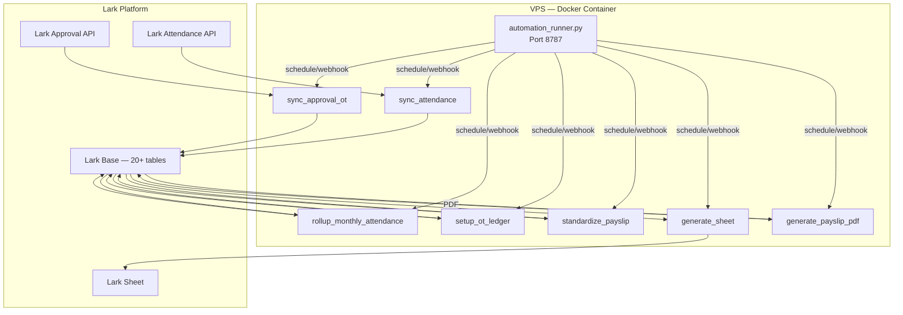
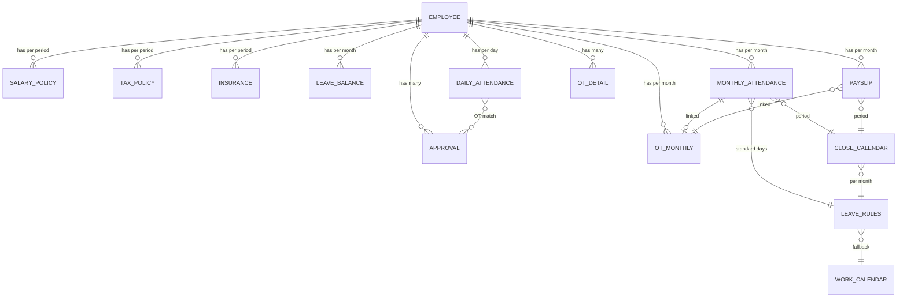

# Phân tích Hệ thống Hiện tại — Asnova Payroll

> Tài liệu này mô tả chi tiết kiến trúc hiện tại để làm cơ sở cho việc thiết kế hệ thống mới.

---

## 1. Tổng quan Kiến trúc Hiện tại



**Pattern chính**: Python scripts chạy trên VPS, đọc/ghi dữ liệu hoàn toàn qua **Lark Open API**. Không có database trung gian.

---

## 2. Inventory Lark Base Tables

**App Token:** `NYNlbfhByaFir7sOPPhl7FMEgkg`

### 2.1 HR / Employee Master

| Table ID | Tên | Mục đích |
|----------|-----|----------|
| `tblak008sRzCjCPF` | Danh sách nhân sự | Master list — sync từ Lark Admin |
| `tblRTOr2MmfemvO7` | Thông tin lương, phúc lợi | Lương cơ bản, phụ cấp, bank info |
| `tblR2p8W8fbxZ6yF` | Thông tin thuế, bảo hiểm | Mã số thuế, người phụ thuộc |
| `tblkKgPs4299uRUU` | BHXH, BHYT, BHTN | Mức đóng bảo hiểm |
| `tblR7KohpSUaFucm` | Tồn phép năm | Số dư phép năm theo tháng |

### 2.2 Attendance

| Table ID | Tên | Mục đích |
|----------|-----|----------|
| `tblmSa9Z5Z3YnEvN` | Đồng bộ dữ liệu chấm công | Raw daily attendance (1 record/NV/ngày) |
| `tblD48HX8KtWRjnA` | Bảng công tháng | Monthly rollup (legacy) |
| `tblBwFkosS9StGjJ` | Bảng công tháng theo tháng tính lương | Monthly rollup cho payroll (primary) |

### 2.3 Approval / Leave

| Table ID | Tên | Mục đích |
|----------|-----|----------|
| `tblwtwAISFQnTcKz` | Đồng bộ dữ liệu phiếu phê duyệt | OT, nghỉ phép, chỉnh công |

### 2.4 OT

| Table ID | Tên | Mục đích |
|----------|-----|----------|
| `tblYPG4YE6op7jX0` | Chi tiết OT tính lương | OT chi tiết (per day/bucket/NV) |
| `tblGMC8BXiPAFVgj` | Sổ cái OT tháng | OT tổng hợp (per NV/tháng) |

### 2.5 Payroll / Payslip

| Table ID | Tên | Mục đích |
|----------|-----|----------|
| `tblpsWuBWwCuOhK9` | Phiếu lương | Payslip records (primary) |
| `tblLnyAnZ32rD804` | Bảng lương formula | Formula-based payroll |
| `tbl1YaWzWFB9Cdgj` | Phiếu lương chuẩn (clean) | Payslip đã chuẩn hóa cho PDF |
| `tblFUkz9NOADBVwq` | Bảng lương (older) | Payroll cũ, dùng bởi rollup/policy |

### 2.6 Calendar / Rules / Admin

| Table ID | Tên | Mục đích |
|----------|-----|----------|
| `tbleLSKyuQvgge21` | Lịch chốt công | Payroll period, auto-close settings |
| `tbl2GdNlYQfiySFD` | Quy tắc nghỉ | Công chuẩn theo nhóm/tháng |
| `tblcZi0NfJe8WNv3` | Lịch năm | Ngày lễ, weekend, company trip |
| `tblFJ7kwfc1H0qFS` | Quản lý Bảng lương tháng - Sheet | Track created Lark Sheets |

---

## 3. Entity Relationships



---

## 4. Automation Schedule

### 4.1 Periodic Flows (mỗi 30 phút)

| Code | Tên | Script |
|------|-----|--------|
| `AUTO-ATT-SYNC` | Đồng bộ chấm công | `sync_attendance_until_today.py` |
| `AUTO-APPROVAL-SYNC` | Đồng bộ phiếu + OT ledger | `run_approval_sync_and_ot_ledger.py` |
| `AUTO-MONTHLY-ATT-ROLLUP` | Rollup bảng công tháng | `rollup_monthly_attendance_from_raw.py` |
| `AUTO-PAYSLIP-CALC` | Tính phiếu lương | `standardize_payslip_table.py` |
| `AUTO-MONTHLY-CLOSE` | Poll Lịch chốt công | `process_payroll_close_calendar.py` |

### 4.2 Hourly / Daily

| Code | Tên | Schedule |
|------|-----|----------|
| `AUTO-NIGHT-SHIFT-SYNC` | Đổi group ca đêm | Max 60 phút |
| `AUTO-PAYROLL-SHEET` | Tạo Lark Sheet lương | Daily 06:00 |

### 4.3 Manual / Webhook Only

| Code | Tên |
|------|-----|
| `AUTO-BH-RECALC` | Tính lại bảo hiểm |
| `AUTO-OT-LEDGER` | Tách bucket OT |
| `AUTO-PAYROLL-PREVIEW` | Preview Bảng lương |
| `AUTO-POLICY-SNAPSHOT` | Rollover chính sách |
| `AUTO-ATTENDANCE-SHEET` | Tạo Sheet bảng công |
| `AUTO-PAYSLIP` | Tạo phiếu lương PDF |

### 4.4 Flow Groups

```
LIGHT_SYNC     = ATT-SYNC → APPROVAL-SYNC → NIGHT-SHIFT → MONTHLY-ROLLUP → PAYSLIP-CALC → CLOSE
PAYROLL_CALC   = BH-RECALC → MONTHLY-ROLLUP → OT-LEDGER → PAYSLIP-CALC → POLICY-SNAPSHOT → PREVIEW
PAYROLL_OUTPUT = ATTENDANCE-SHEET → PAYROLL-SHEET → PAYSLIP-PDF
PAYROLL_ALL    = BH-RECALC → PAYROLL_CALC → PAYROLL_OUTPUT
```

---

## 5. Business Rules

### 5.1 Payroll Periods

- Kỳ công xác định bởi `Lịch chốt công`: `Ngày bắt đầu kỳ công` → `Ngày kết thúc kỳ công`
- Month key: `YYYYMM` (e.g. `202605`)
- Label: `Tháng MM/YYYY` (e.g. `Tháng 05/2026`)
- Auto-close khi: `Tự động chốt = true` AND `Trạng thái ∈ {Đã lên lịch, Sẵn sàng}` AND `Ngày chốt ≤ now`

### 5.2 Công chuẩn (Standard Days)

| Schedule | Áp dụng | Cách tính |
|----------|---------|-----------|
| `office` | Mon-Fri | Tổng ngày − T7 − CN − Lễ |
| `six_day` | Mon-Sat (TTVT/Kho) | Tổng ngày − CN − Lễ |

- Detection: keywords `"ttvt"`, `"kho"`, `"warehouse"` trong department/group → `six_day`
- Source: `Quy tắc nghỉ` table, fallback → đếm từ `Lịch năm`
- Giờ chuẩn: **8.0h/ngày**
- Ca chuẩn: **08:00 - 17:00**

### 5.3 Leave Types

| Loại | Bucket | Tính công? |
|------|--------|-----------|
| Phép năm (annual) | `annual` | ✅ Có — credit vào actual days |
| Nghỉ phúc lợi (benefit) | `benefit` | ✅ Có |
| Remote/WFH | `remote` | ✅ Có |
| Nghỉ bù (comp leave) | `comp_leave` | ✅ Có |
| Chỉnh sửa chấm công | `correction` | ✅ Có |
| **Nghỉ KHL (unpaid)** | `unpaid` | ❌ **Không** — trừ khỏi actual days |

### 5.4 OT Buckets

| Bucket | Rate | Loại ngày | Khung giờ |
|--------|------|-----------|-----------|
| OT 150% | 1.5× | Ngày thường | 06:00-22:00 |
| OT 200% | 2.0× | Ngày nghỉ | Ca ngày |
| OT 210% | 2.1× | Ngày thường | Tối → đêm |
| OT 130% | 1.3× | Ngày thường | Ca đêm |
| Ca đêm 30% | 0.3× | Ngày thường | 22:00-06:00 phụ cấp |
| Night 50% | 0.5× | Ngày thường | Ngoài 06:00-22:00 |
| OT 270% | 2.7× | Ngày nghỉ | Đêm |
| OT 300% | 3.0× | Ngày lễ | Ngày |
| OT 390% | 3.9× | Ngày lễ | Đêm |

### 5.5 Insurance (BHXH)

| Loại | Nhân viên | Công ty | Trần |
|------|-----------|---------|------|
| BHXH | 8% | 17.5% | 46,800,000đ |
| BHYT | 1.5% | 3% | 46,800,000đ |
| BHTN | 1% | 1% | 99,200,000đ |

- Part-time (P) & M-type: không đóng BH
- GĐ: không đóng BHTN

### 5.6 Thuế TNCN (PIT)

| Bậc | Thu nhập chịu thuế | Thuế suất |
|-----|---------------------|-----------|
| 1 | ≤ 5M | 5% |
| 2 | 5M - 10M | 10% − 250K |
| 3 | 10M - 18M | 15% − 750K |
| 4 | 18M - 32M | 20% − 1.65M |
| 5 | 32M - 52M | 25% − 3.25M |
| 6 | 52M - 80M | 30% − 5.85M |
| 7 | > 80M | 35% − 9.85M |

- Giảm trừ người phụ thuộc: 6,200,000đ/người

---

## 6. Lark API Integration Pattern

### Authentication
- **Tenant Access Token** via `POST /auth/v3/tenant_access_token/internal`
- Env vars: `LARK_APP_ID=<your_lark_app_id>`, `LARK_APP_SECRET=<your_lark_app_secret>`

### Key APIs

| Operation | Endpoint | Batch Size |
|-----------|----------|------------|
| List Records | `GET /bitable/v1/apps/{app}/tables/{table}/records` | page_size=500 |
| Batch Create | `POST .../records/batch_create` | 500 |
| Batch Update | `POST .../records/batch_update` | 500 |
| List Fields | `GET .../fields` | — |
| Attendance Flows | `POST /attendance/v1/user_flows/query` | 50 user_ids |

### Retry & Timeout
- 4 attempts, 1.5× backoff on 429/5xx
- 45s per API call, 900s per flow

### Webhook Server (Port 8787)
- `POST /run` — trigger automation
- `POST /payslip/pdf` — generate single payslip
- `POST /lark/events` — Lark event callback
- `GET /health` — health check
- `/ui`, `/admin` — Admin UI

### Idempotency Keys
- Attendance: `ATT-DAY-{user_id}-{yyyyMMdd}`
- Approval: `APPROVAL-{instance_code}`
- OT Detail: `OT-{instance_code}-{bucket}-{segment_start}`
- Leave Balance: `LEAVE-BAL-{user_id}-{yyyyMM}`

---

## 7. Các vấn đề đã phát hiện

### 7.1 Bug nghỉ phép không lương (KHL)
- **File**: `rollup_monthly_attendance_from_raw.py` line 429-430
- **Vấn đề**: Unpaid leave bị `continue` — không track, không trừ khỏi công thực tế
- **Impact**: Công thực tế luôn = Công chuẩn cho NV nghỉ KHL

### 7.2 Không có audit trail
- Không biết giá trị cũ là gì trước khi bị overwrite
- Chỉ có dry-run JSON output, không persistent

### 7.3 Data inconsistency risk
- `Giờ nghỉ phép không lương` field tồn tại trên Lark Base nhưng KHÔNG có code nào ghi vào
- Multiple scripts ghi cùng fields → race condition potential

### 7.4 Performance
- Mỗi rollup phải gọi Lark API 5-10 lần (list records cho mỗi table)
- Không cache, mỗi cycle fetch lại toàn bộ
