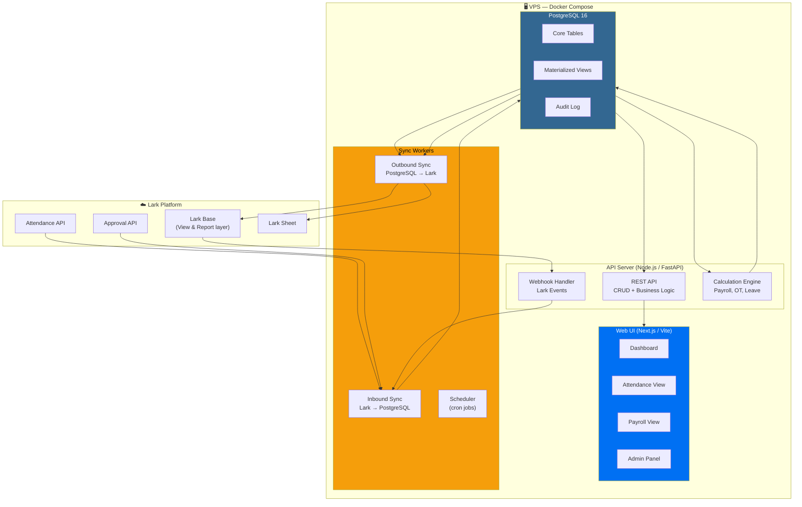
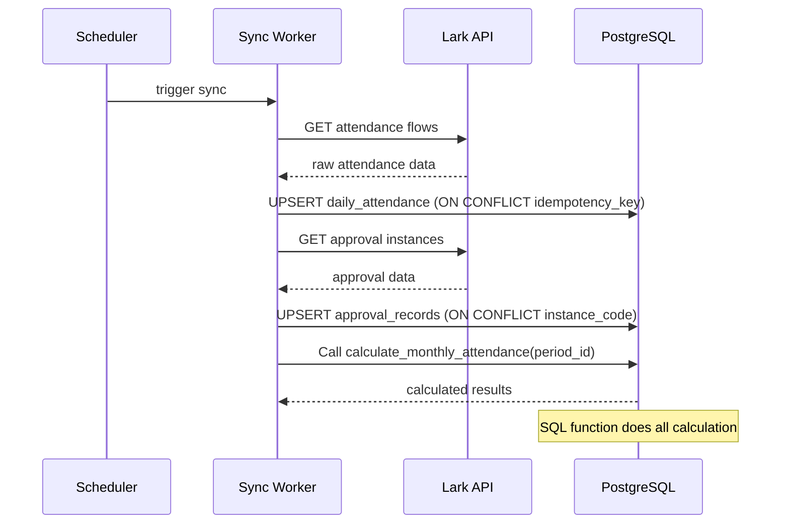
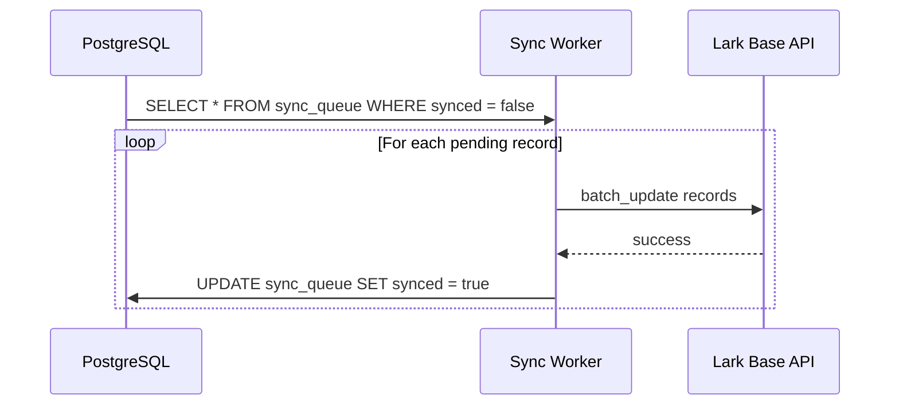

# Architecture Design — Asnova Payroll v2

> **Status**: Draft — cần review & phản hồi  
> **Mục tiêu**: PostgreSQL làm source of truth, Web UI cho C&B, Lark Base là view layer

---

## 1. High-Level Architecture



---

## 2. Tech Stack (Confirmed)

| Layer | Công nghệ | Confirmed |
|-------|-----------|----------|
| **Database** | PostgreSQL 16 (đã có trên VPS) | ✅ |
| **Backend API** | Node.js + Express + Prisma + TypeScript | ✅ |
| **Frontend** | Vite + React + TypeScript + Tailwind CSS v4 | ✅ |
| **Design System** | Unified Design System (Framer Motion, Lucide, Recharts) | ✅ |
| **Lark Integration** | Custom Lark API client (rewrite from Python) | ✅ |
| **Hosting** | VPS hiện tại (61.14.233.201) + Docker | ✅ |

## 3. Design Principles

| # | Principle | Chi tiết |
|---|-----------|----------|
| 1 | **PostgreSQL = Source of Truth** | Mọi tính toán dựa trên DB, không phụ thuộc Lark API |
| 2 | **Lark Base = View Layer** | Sync kết quả từ DB → Lark Base để C&B xem/report |
| 3 | **Tính toán bằng SQL** | Công thực tế, OT, lương — SQL views/functions thay Python |
| 4 | **Audit mọi thay đổi** | Trigger-based audit log cho mọi UPDATE/DELETE |
| 5 | **Idempotent sync** | Mọi sync operation đều idempotent, safe to retry |
| 6 | **Incremental sync** | Chỉ sync data thay đổi, không full refresh |

---

## 3. Database Schema (Core)

### 3.1 Entity Overview

```mermaid
erDiagram
    employees ||--o{ salary_policies : "has per period"
    employees ||--o{ insurance_policies : "has per period"
    employees ||--o{ tax_policies : "has per period"
    employees ||--o{ daily_attendance : "has per day"
    employees ||--o{ approval_records : "has many"
    employees ||--o{ leave_balances : "has per month"
    employees ||--o{ monthly_attendance : "has per period"
    employees ||--o{ ot_details : "has many"
    employees ||--o{ ot_monthly : "has per period"
    employees ||--o{ payslips : "has per period"

    payroll_periods ||--o{ monthly_attendance : "contains"
    payroll_periods ||--o{ ot_monthly : "contains"
    payroll_periods ||--o{ payslips : "contains"

    leave_rules ||--o{ payroll_periods : "standard days for"
    work_calendar ||--o{ leave_rules : "fallback"

    employees {
        uuid id PK
        varchar user_id UK "ASV001, ASV002..."
        varchar lark_record_id UK
        varchar full_name
        varchar department
        varchar position
        varchar schedule_type "office | six_day"
        varchar employment_type "FT | PT | P | M"
        date join_date
        date leave_date
        varchar status "active | inactive"
        jsonb lark_metadata
        timestamptz created_at
        timestamptz updated_at
    }

    daily_attendance {
        uuid id PK
        uuid employee_id FK
        date attendance_date
        varchar idempotency_key UK
        timestamptz check_in
        timestamptz check_out
        decimal work_hours "giờ làm thực tế"
        decimal ot_hours "giờ OT tạm tính"
        decimal late_hours
        decimal early_hours
        varchar source "lark_sync | manual"
        varchar lark_record_id
        jsonb raw_lark_data
        timestamptz synced_at
    }

    approval_records {
        uuid id PK
        uuid employee_id FK
        varchar instance_code UK
        varchar approval_type "Nghỉ phép | OT | Chỉnh công"
        varchar leave_type "annual | unpaid | benefit | comp | remote"
        varchar status "APPROVED | REJECTED | PENDING"
        date apply_date
        decimal approved_hours
        decimal approved_days
        timestamptz start_time
        timestamptz end_time
        varchar lark_record_id
        jsonb raw_lark_data
        timestamptz synced_at
    }

    payroll_periods {
        uuid id PK
        varchar month_key UK "202605"
        varchar label "Tháng 05/2026"
        date period_start
        date period_end
        varchar status "open | scheduled | closed"
        boolean auto_close
        timestamptz close_at
        varchar lark_record_id
    }

    monthly_attendance {
        uuid id PK
        uuid employee_id FK
        uuid period_id FK
        decimal standard_days "công chuẩn"
        decimal raw_actual_days "ngày có chấm công"
        decimal paid_credit_hours "giờ nghỉ hưởng lương"
        decimal unpaid_hours "giờ nghỉ KHL"
        decimal actual_days "công thực tế = raw + credits - unpaid"
        decimal absent_days "ngày vắng mặt"
        decimal work_hours
        decimal late_hours
        decimal early_hours
        decimal annual_leave_hours
        decimal benefit_leave_hours
        decimal remote_hours
        decimal comp_leave_hours
        decimal correction_hours
        varchar lark_record_id
        timestamptz calculated_at
    }

    ot_details {
        uuid id PK
        uuid employee_id FK
        uuid approval_id FK
        varchar idempotency_key UK
        date work_date
        varchar bucket "OT 150% | OT 200% | ..."
        decimal rate
        decimal hours
        decimal amount
        timestamptz calculated_at
    }

    ot_monthly {
        uuid id PK
        uuid employee_id FK
        uuid period_id FK
        decimal total_ot_hours
        decimal total_ot_amount
        jsonb bucket_breakdown
        varchar lark_record_id
        timestamptz calculated_at
    }

    payslips {
        uuid id PK
        uuid employee_id FK
        uuid period_id FK
        decimal base_salary
        decimal allowances
        decimal ot_amount
        decimal gross_income
        decimal insurance_employee
        decimal insurance_employer
        decimal taxable_income
        decimal pit_amount
        decimal net_salary
        jsonb full_breakdown
        varchar status "draft | confirmed | paid"
        varchar lark_record_id
        timestamptz calculated_at
    }

    salary_policies {
        uuid id PK
        uuid employee_id FK
        varchar period_key
        decimal base_salary
        decimal position_allowance
        decimal responsibility_allowance
        decimal lunch_allowance
        decimal transport_allowance
        decimal phone_allowance
        jsonb other_allowances
        varchar lark_record_id
    }

    insurance_policies {
        uuid id PK
        uuid employee_id FK
        varchar period_key
        decimal insurance_basis
        decimal bhxh_employee
        decimal bhxh_employer
        decimal bhyt_employee
        decimal bhyt_employer
        decimal bhtn_employee
        decimal bhtn_employer
        varchar lark_record_id
    }

    tax_policies {
        uuid id PK
        uuid employee_id FK
        varchar period_key
        decimal personal_deduction
        integer dependents
        decimal dependent_deduction
        varchar tax_code
        varchar lark_record_id
    }

    leave_balances {
        uuid id PK
        uuid employee_id FK
        varchar month_key
        decimal opening_balance
        decimal accrued
        decimal used
        decimal adjustment
        decimal seniority_bonus
        decimal closing_balance
        varchar lark_record_id
    }

    leave_rules {
        uuid id PK
        varchar month_key
        varchar schedule_type
        decimal standard_days
        decimal working_days
        varchar lark_record_id
    }

    work_calendar {
        uuid id PK
        date calendar_date UK
        varchar day_type "workday | weekend | holiday | company_trip"
        boolean counts_as_standard
        varchar note
        varchar lark_record_id
    }

    audit_log {
        bigserial id PK
        varchar table_name
        uuid record_id
        varchar action "INSERT | UPDATE | DELETE"
        jsonb old_data
        jsonb new_data
        varchar changed_by
        timestamptz changed_at
    }
```



### 3.2 Key SQL Views (thay thế Python logic)

```sql
-- View: Công thực tế = raw_actual + paid_credits/8 - unpaid/8
CREATE OR REPLACE VIEW v_monthly_attendance_calculated AS
SELECT
    ma.id,
    ma.employee_id,
    e.user_id,
    pp.month_key,
    ma.standard_days,
    ma.raw_actual_days,

    -- Paid credit days
    ROUND((COALESCE(ma.annual_leave_hours, 0)
         + COALESCE(ma.benefit_leave_hours, 0)
         + COALESCE(ma.remote_hours, 0)
         + COALESCE(ma.comp_leave_hours, 0)
         + COALESCE(ma.correction_hours, 0)) / 8.0, 2) AS paid_credit_days,

    -- Unpaid leave days
    ROUND(COALESCE(ma.unpaid_hours, 0) / 8.0, 2) AS unpaid_days,

    -- Actual days = min(raw + credits, standard) - unpaid
    GREATEST(
        LEAST(
            ma.raw_actual_days + ROUND((COALESCE(ma.annual_leave_hours, 0)
                + COALESCE(ma.benefit_leave_hours, 0)
                + COALESCE(ma.remote_hours, 0)
                + COALESCE(ma.comp_leave_hours, 0)
                + COALESCE(ma.correction_hours, 0)) / 8.0, 2),
            ma.standard_days
        ) - ROUND(COALESCE(ma.unpaid_hours, 0) / 8.0, 2),
        0
    ) AS actual_days,

    -- Absent days = elapsed_standard - actual
    GREATEST(ma.standard_days - actual_days_calc, 0) AS absent_days

FROM monthly_attendance ma
JOIN employees e ON e.id = ma.employee_id
JOIN payroll_periods pp ON pp.id = ma.period_id;
```

---

## 4. Sync Architecture

### 4.1 Inbound Sync (Lark → PostgreSQL)



### 4.2 Outbound Sync (PostgreSQL → Lark Base)



### 4.3 Sync Schedule (giữ tương thích hệ thống cũ)

| Job | Interval | Mô tả |
|-----|----------|--------|
| `sync_attendance_inbound` | 30 min | Lark Attendance API → `daily_attendance` |
| `sync_approval_inbound` | 30 min | Lark Approval API → `approval_records` |
| `calculate_monthly` | 30 min | Recalculate `monthly_attendance` |
| `sync_attendance_outbound` | 30 min | `monthly_attendance` → Lark Base |
| `sync_payroll_outbound` | On demand | `payslips` → Lark Base |
| `generate_sheets` | Daily 06:00 | Generate Lark Sheets |

---

## 5. Web UI

### 5.1 Pages

| Page | Mô tả | Priority |
|------|--------|----------|
| `/dashboard` | Tổng quan: NV, công, lương tháng | P0 |
| `/attendance` | Bảng công tháng, filter theo phòng ban/NV | P0 |
| `/attendance/:id` | Chi tiết chấm công 1 NV | P0 |
| `/payroll` | Bảng lương tháng | P1 |
| `/payroll/:id` | Chi tiết phiếu lương 1 NV | P1 |
| `/employees` | Danh sách NV, edit thông tin | P1 |
| `/leave` | Quản lý nghỉ phép | P2 |
| `/ot` | OT detail & ledger | P2 |
| `/settings` | Cấu hình: periods, rules, sync | P2 |
| `/audit` | Audit log viewer | P2 |

### 5.2 Dashboard Mockup Concept

```
┌──────────────────────────────────────────────────────────┐
│  ASNOVA Payroll                    Tháng 05/2026    👤   │
├──────────────────────────────────────────────────────────┤
│  ┌─────────┐ ┌─────────┐ ┌─────────┐ ┌─────────┐       │
│  │ 16 NV   │ │ 25 ngày │ │ 3 NV    │ │ Chưa    │       │
│  │ Active  │ │ Công    │ │ Nghỉ    │ │ chốt    │       │
│  │         │ │ chuẩn   │ │ KHL     │ │ công    │       │
│  └─────────┘ └─────────┘ └─────────┘ └─────────┘       │
│                                                          │
│  ┌─ Bảng công tháng ──────────────────────────────────┐ │
│  │ Mã NV  │ Tên     │ Chuẩn │ Thực tế │ Vắng │ KHL  │ │
│  │ ASV001 │ Nguyễn  │ 20    │ 18.94   │ 1.06 │ 0    │ │
│  │ ASV017 │ Trần    │ 25    │ 22.00   │ 0.00 │ 24h  │ │
│  │ ...    │ ...     │ ...   │ ...     │ ...  │ ...  │ │
│  └────────────────────────────────────────────────────┘ │
│                                                          │
│  ┌─ Sync Status ──────────┐ ┌─ Quick Actions ─────────┐ │
│  │ Attendance: 5 min ago  │ │ [Sync Now]              │ │
│  │ Approval: 3 min ago    │ │ [Recalculate]           │ │
│  │ Lark Base: 10 min ago  │ │ [Generate Sheet]        │ │
│  └────────────────────────┘ └─────────────────────────┘ │
└──────────────────────────────────────────────────────────┘
```

---

## 6. Migration Strategy

### Phase 0: Foundation (Week 1)
- [ ] Setup PostgreSQL schema + migrations
- [ ] Setup API project (Node.js or FastAPI)
- [ ] Setup Web UI project (Next.js or Vite)

### Phase 1: Inbound Sync (Week 2)
- [ ] Port `sync_attendance_until_today.py` → Write to PostgreSQL
- [ ] Port `sync_approval_ot_and_attendance_match.py` → Write to PostgreSQL
- [ ] Sync HR master from Lark Base → `employees`

### Phase 2: Calculation Engine (Week 3)
- [ ] Port `rollup_monthly_attendance_from_raw.py` → SQL functions
- [ ] Port `setup_ot_ledger_and_rollup.py` → SQL functions
- [ ] Port payroll calculation → SQL functions

### Phase 3: Outbound Sync (Week 3-4)
- [ ] PostgreSQL → Lark Base sync for monthly attendance
- [ ] PostgreSQL → Lark Base sync for payroll
- [ ] Sheet generation from PostgreSQL data

### Phase 4: Web UI (Week 4-5)
- [ ] Dashboard
- [ ] Attendance views
- [ ] Payroll views

### Phase 5: Cutover (Week 6)
- [ ] Run both systems in parallel
- [ ] Verify data consistency
- [ ] Switch source of truth to PostgreSQL

---

## 7. Decisions

> Tất cả quyết định đã được confirm. Xem chi tiết tại [03-architecture-decisions.md](./03-architecture-decisions.md).

| # | Quyết định |
|---|------------|
| Q1 | Backend: **Node.js + Express + Prisma + TypeScript** |
| Q2 | Frontend: **Vite + React + TypeScript + Tailwind CSS v4** |
| Q3 | Lark Base: **Read-only view** — sync kết quả, không edit trên Lark |
| Q4 | Automation: **Thay hoàn toàn** — rewrite Node.js, giữ business logic |
