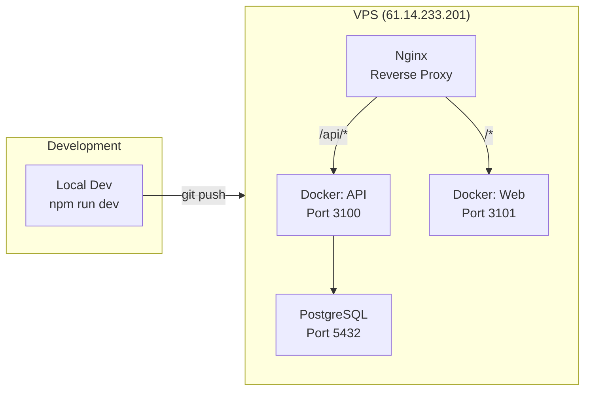

# Architecture Decisions — Confirmed

> **Ngày quyết định**: 2026-05-29  
> **Approved by**: Product Owner

---

## Quyết định

| # | Câu hỏi | Quyết định | Lý do |
|---|---------|------------|-------|
| Q1 | Backend stack | **Node.js + Express + Prisma ORM** | Rewrite toàn bộ, team đã quen Node.js |
| Q2 | Frontend stack | **Vite + React + TypeScript + Tailwind CSS v4** | Nhẹ, SPA internal tool |
| Q3 | Lark Base role | **Read-only view** — chỉ sync kết quả, không edit trên Lark | Tránh sync conflicts |
| Q4 | Automation | **Thay hoàn toàn** automation_runner.py, giữ business logic | Clean rewrite Node.js |

---

## Tech Stack Chi tiết

### Backend
| Component | Technology | Version |
|-----------|-----------|---------|
| Runtime | Node.js | 20 LTS |
| Framework | Express.js | 4.x |
| Language | TypeScript | 5.x |
| ORM | Prisma | 6.x |
| Database | PostgreSQL | 16 (đã có trên VPS) |
| Validation | Zod | 3.x |
| Scheduler | node-cron | 3.x |
| Lark SDK | Custom (port from Python) | — |
| Auth | JWT (internal) | — |

### Frontend
| Component | Technology | Version |
|-----------|-----------|---------|
| Build Tool | Vite | 6.x |
| UI Library | React | 19.x |
| Language | TypeScript | 5.x |
| Styling | Tailwind CSS | v4 |
| Animation | Framer Motion | 11.x |
| Icons | Lucide React | latest |
| Charts | Recharts | 2.x |
| State | Zustand or React Query | — |
| Router | React Router | 7.x |

### Design System
- **Baseline**: Unified Design System (SKILL.md)
- **CSS Variables**: Semantic tokens only (`bg-card`, `text-foreground`, `border-border`)
- **Typography**: Inter (UI) + JetBrains Mono (numbers/code)
- **Financial data**: `font-mono tabular-nums` — MANDATORY
- **Icons**: Lucide React, strokeWidth 1.5
- **No native `<select>`** — custom dropdowns
- **Spacing**: 4px base unit

### Infrastructure
| Component | Technology |
|-----------|-----------|
| VPS | 61.14.233.201 (Ubuntu 22.04) |
| Container | Docker + Docker Compose |
| Reverse Proxy | Nginx (đã có) |
| Database | PostgreSQL 16 (đã có, port 5432) |

---

## Project Structure

```
product-code-base/asnova-payroll/
├── docs/                          # Architecture & design docs
│   ├── 00-project-overview.md
│   ├── 01-current-system-analysis.md
│   ├── 02-architecture-design.md
│   ├── 03-architecture-decisions.md  ← (this file)
│   └── 04-database-schema.md
│
├── packages/
│   ├── api/                       # Backend API (Node.js + Express)
│   │   ├── src/
│   │   │   ├── config/            # Environment, constants
│   │   │   ├── modules/           # Feature modules
│   │   │   │   ├── employees/     # CRUD + business logic
│   │   │   │   ├── attendance/    # Daily sync, monthly rollup
│   │   │   │   ├── approval/      # Leave, OT, corrections
│   │   │   │   ├── payroll/       # Payroll calculation
│   │   │   │   ├── ot/            # OT bucket, ledger
│   │   │   │   └── sync/          # Lark inbound/outbound sync
│   │   │   ├── shared/            # Shared utilities
│   │   │   │   ├── lark/          # Lark API client
│   │   │   │   ├── db/            # Prisma client
│   │   │   │   └── utils/         # Helpers
│   │   │   ├── scheduler/         # Cron jobs
│   │   │   └── server.ts          # Express app entry
│   │   ├── prisma/
│   │   │   └── schema.prisma      # Database schema
│   │   ├── package.json
│   │   └── tsconfig.json
│   │
│   └── web/                       # Frontend (Vite + React)
│       ├── src/
│       │   ├── components/
│       │   │   ├── ui/            # Design system components
│       │   │   └── features/      # Feature-specific components
│       │   ├── pages/
│       │   │   ├── Dashboard.tsx
│       │   │   ├── Attendance.tsx
│       │   │   ├── Payroll.tsx
│       │   │   ├── Employees.tsx
│       │   │   └── Settings.tsx
│       │   ├── hooks/             # Custom hooks
│       │   ├── services/          # API client
│       │   ├── stores/            # State management
│       │   ├── types/             # TypeScript types
│       │   ├── App.tsx
│       │   └── main.tsx
│       ├── public/
│       ├── index.html
│       ├── tailwind.config.ts
│       ├── vite.config.ts
│       └── package.json
│
├── docker-compose.yml             # Full stack compose
├── .env.example
└── README.md
```

---

## Module Breakdown

### Backend Modules

| Module | Entities | Key Functions | Priority |
|--------|----------|---------------|----------|
| `employees` | Employee, SalaryPolicy, TaxPolicy, InsurancePolicy | CRUD, policy management | P0 |
| `attendance` | DailyAttendance, MonthlyAttendance | Sync from Lark, rollup calculation | P0 |
| `approval` | ApprovalRecord | Sync from Lark, classify leave types | P0 |
| `payroll` | PayrollPeriod, Payslip | Period management, salary calculation | P1 |
| `ot` | OtDetail, OtMonthly | OT bucket classification, ledger | P1 |
| `sync` | SyncJob, SyncLog | Inbound/outbound Lark sync | P0 |

### Frontend Pages

| Page | Components | Data Source | Priority |
|------|-----------|-------------|----------|
| Dashboard | KPI Cards, Charts, Sync Status | GET /api/dashboard | P0 |
| Attendance | DataTable, Filters, Detail Modal | GET /api/attendance/monthly | P0 |
| Employees | DataTable, Profile Cards, Edit Form | GET /api/employees | P1 |
| Payroll | DataTable, Payslip Detail | GET /api/payroll | P1 |
| Settings | Period Config, Sync Controls | GET /api/settings | P2 |

---

## Business Logic Porting Plan

### Từ Python → Node.js/SQL

| Logic | Python File | Port To | Strategy |
|-------|------------|---------|----------|
| Attendance sync | `sync_attendance_until_today.py` | `modules/attendance/sync.ts` | Rewrite in TS, same Lark API |
| Approval sync | `sync_approval_ot_and_attendance_match.py` | `modules/approval/sync.ts` | Rewrite, simplify OT match |
| Monthly rollup | `rollup_monthly_attendance_from_raw.py` | SQL function + `modules/attendance/rollup.ts` | SQL for calculation, TS for orchestration |
| Period rules | `payroll_period_rules.py` | `modules/payroll/period-rules.ts` | Direct port |
| OT ledger | `setup_ot_ledger_and_rollup.py` | SQL function + `modules/ot/ledger.ts` | SQL for bucket calc |
| Payslip calc | `standardize_payslip_table.py` | SQL function + `modules/payroll/calculate.ts` | SQL for PIT/insurance calc |
| Leave bucket | `leave_type_bucket()` | `shared/utils/leave-types.ts` | Direct port |
| Idempotency | `client_token` pattern | Prisma `upsert` + unique constraints | Built into DB |

---

## Deployment Plan



### Nginx Config (new)
```nginx
server {
    server_name payroll.learntoautomate.io;

    location /api/ {
        proxy_pass http://127.0.0.1:3100/api/;
        proxy_http_version 1.1;
        proxy_set_header Host $host;
    }

    location / {
        proxy_pass http://127.0.0.1:3101/;
        proxy_http_version 1.1;
        proxy_set_header Host $host;
    }
}
```

---

## Next Steps

1. **Khởi tạo project** — `packages/api` (Express + Prisma) + `packages/web` (Vite + React)
2. **Database schema** — Prisma schema file, migrate lên PostgreSQL VPS
3. **Lark API client** — Port authentication + CRUD helpers từ Python
4. **Module `attendance`** — Sync + rollup (MVP)
5. **Web UI Dashboard** — Dashboard + Attendance view
