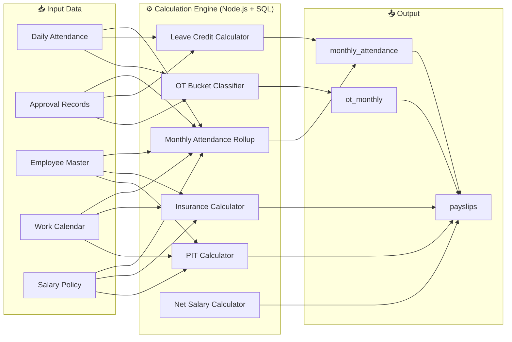
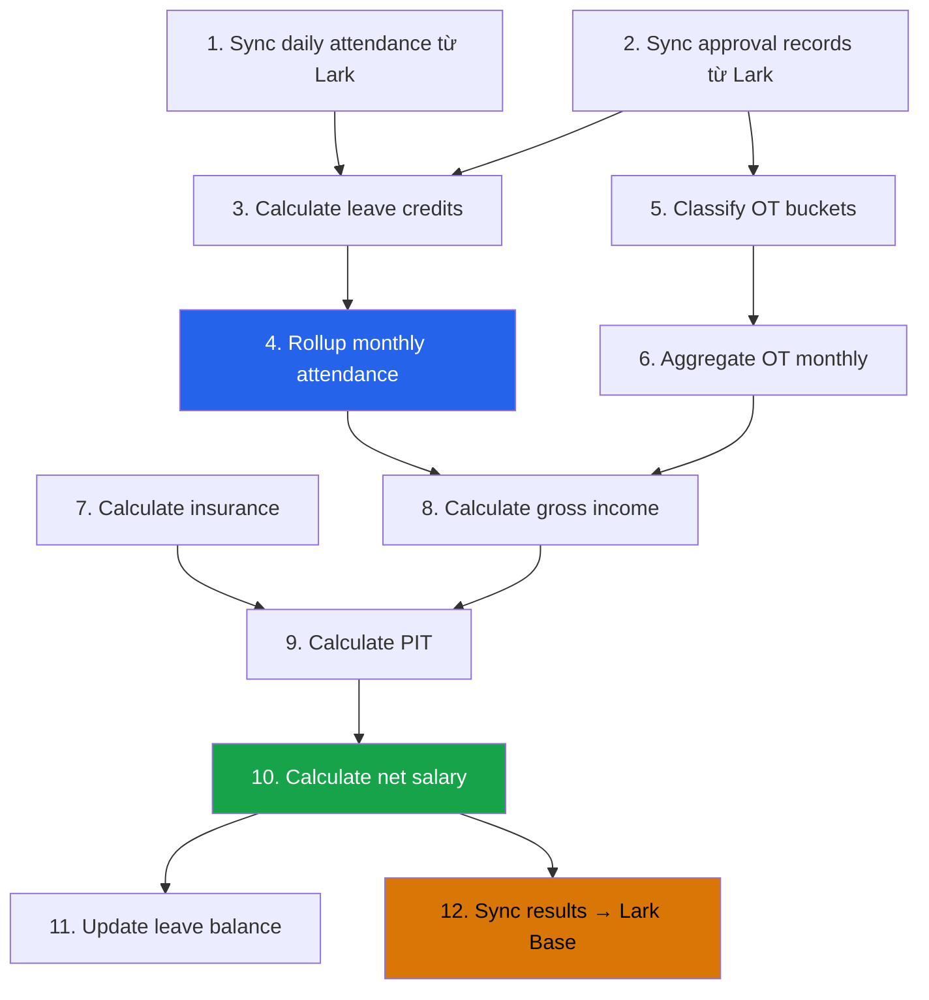

# Calculation Engine — Business Logic trên Platform

> **Nguyên tắc**: PostgreSQL + Node.js tính toán **100% logic**. Không phụ thuộc Lark Base.  
> **Tài liệu tham chiếu**: Port từ Python codebase hiện tại + business rules đã document.

---

## 1. Tổng quan



---

## 2. Attendance Rollup — Tính công tháng

### 2.1 Công chuẩn (Standard Days)

```typescript
// Port từ: payroll_period_rules.py → period_standard_days()

function calculateStandardDays(
  calendarDays: WorkCalendarDay[],
  scheduleType: 'office' | 'six_day',
  periodStart: Date,
  periodEnd: Date
): number {
  return calendarDays
    .filter(day => day.date >= periodStart && day.date <= periodEnd)
    .filter(day => day.countsAsStandard)
    .filter(day => {
      if (scheduleType === 'office') {
        // Mon-Fri only
        return day.dayOfWeek >= 1 && day.dayOfWeek <= 5;
      } else {
        // Mon-Sat (TTVT/Kho)
        return day.dayOfWeek >= 1 && day.dayOfWeek <= 6;
      }
    })
    .length;
}
```

**Nguồn**: `Quy tắc nghỉ` table → hoặc fallback đếm từ `Lịch năm`  
**Schedule detection**: Keywords `"ttvt"`, `"kho"`, `"warehouse"` → `six_day`

### 2.2 Raw Actual Days (Ngày chấm công thực tế)

```sql
-- Tổng hợp từ daily_attendance trong kỳ
SELECT
  employee_id,
  SUM(work_hours) / 8.0 AS raw_actual_days,
  SUM(work_hours) AS total_work_hours,
  SUM(late_hours) AS total_late_hours,
  SUM(early_hours) AS total_early_hours,
  COUNT(CASE WHEN late_hours > 0 THEN 1 END) AS late_days,
  COUNT(CASE WHEN early_hours > 0 THEN 1 END) AS early_days
FROM daily_attendance
WHERE attendance_date BETWEEN :period_start AND :period_end
GROUP BY employee_id;
```

### 2.3 Leave Credits (Giờ nghỉ được duyệt — tính vào công)

```typescript
// Port từ: rollup_monthly_attendance_from_raw.py → approval_leave_credits()

interface LeaveCredits {
  annual_hours: number;      // Phép năm
  benefit_hours: number;     // Phúc lợi (sinh nhật, cưới...)
  remote_hours: number;      // Remote/WFH
  comp_leave_hours: number;  // Nghỉ bù
  correction_hours: number;  // Chỉnh sửa chấm công
  unpaid_hours: number;      // Nghỉ không lương (TRỪKHỎI công)
}

function classifyLeaveType(leaveType: string, label: string): LeaveCredits['type'] {
  const normalized = removeVietnameseTones(leaveType + ' ' + label).toLowerCase();

  if (['khong huong luong', 'nghi om', 'bhxh', 'sick', 'unpaid'].some(m => normalized.includes(m))) {
    return 'unpaid';
  }
  if (['phuc loi', 'welfare', 'sinh nhat', 'che do'].some(m => normalized.includes(m))) {
    return 'benefit';
  }
  if (['remote', 'wfh', 'work from home', 'lam viec tu xa'].some(m => normalized.includes(m))) {
    return 'remote';
  }
  if (['nghi bu', 'compensatory', 'comp leave'].some(m => normalized.includes(m))) {
    return 'comp_leave';
  }
  return 'annual'; // default = phép năm
}
```

### 2.4 Công thực tế (Actual Days) — **FORMULA CHÍNH**

```typescript
// Port từ: rollup_monthly_attendance_from_raw.py → credited_attendance_days()

const STANDARD_HOURS = 8.0;

function calculateActualDays(
  rawActualDays: number,
  standardDays: number,
  credits: LeaveCredits
): { actualDays: number; absentDays: number; unpaidDays: number } {

  // 1. Tổng giờ credit (paid leave)
  const paidCreditHours =
    credits.annual_hours +
    credits.benefit_hours +
    credits.remote_hours +
    credits.comp_leave_hours +
    credits.correction_hours;

  // 2. Công thực tế = raw + paid credits, cap tại standard
  let actualDays = rawActualDays + round(paidCreditHours / STANDARD_HOURS, 2);
  actualDays = Math.min(actualDays, standardDays);

  // 3. TRỪ nghỉ không lương
  const unpaidDays = round(credits.unpaid_hours / STANDARD_HOURS, 2);
  actualDays = round(Math.max(actualDays - unpaidDays, 0), 2);

  // 4. Ngày vắng mặt
  const absentDays = round(Math.max(standardDays - actualDays, 0), 2);

  return { actualDays, absentDays, unpaidDays };
}
```

> [!IMPORTANT]
> Đây chính là bug đã fix — code Python cũ SKIP nghỉ KHL (`continue`), không trừ khỏi `actualDays`.

---

## 3. OT Bucket Classification — Phân loại OT

```typescript
// Port từ: setup_ot_ledger_and_rollup.py

interface OtBucket {
  bucket: string;
  rate: number;
  hours: number;
  amount: number;  // = hours × rate × hourlyRate
}

const OT_BUCKETS = {
  'OT 150%':    { rate: 1.5, dayType: 'workday',  timeFrame: 'day' },
  'OT 200%':    { rate: 2.0, dayType: 'day_off',  timeFrame: 'day' },
  'OT 210%':    { rate: 2.1, dayType: 'workday',  timeFrame: 'evening_to_night' },
  'OT 130%':    { rate: 1.3, dayType: 'workday',  timeFrame: 'night_shift' },
  'Ca đêm 30%': { rate: 0.3, dayType: 'workday',  timeFrame: 'night_allowance' },
  'OT 270%':    { rate: 2.7, dayType: 'day_off',  timeFrame: 'night' },
  'OT 300%':    { rate: 3.0, dayType: 'holiday',  timeFrame: 'day' },
  'OT 390%':    { rate: 3.9, dayType: 'holiday',  timeFrame: 'night' },
} as const;

// Night boundary: 22:00 - 06:00
const NIGHT_START = 22;
const NIGHT_END = 6;

function classifyOtBucket(
  startTime: Date,
  endTime: Date,
  dayType: 'workday' | 'day_off' | 'holiday'
): OtBucket[] {
  // Split into day/night segments
  // Classify each segment into appropriate bucket
  // Return array of buckets with hours
}
```

### OT Monthly Aggregation

```sql
-- Tổng hợp OT theo tháng cho mỗi nhân viên
SELECT
  employee_id,
  period_id,
  SUM(hours) AS total_ot_hours,
  SUM(amount) AS total_ot_amount,
  jsonb_object_agg(bucket, jsonb_build_object(
    'hours', bucket_hours,
    'amount', bucket_amount
  )) AS bucket_breakdown
FROM (
  SELECT
    employee_id, period_id, bucket,
    SUM(hours) AS bucket_hours,
    SUM(amount) AS bucket_amount
  FROM ot_details
  WHERE period_id = :period_id
  GROUP BY employee_id, period_id, bucket
) sub
GROUP BY employee_id, period_id;
```

---

## 4. Insurance Calculator — Tính bảo hiểm

```typescript
// Port từ: recalculate_insurance_from_salary.py

const INSURANCE_CAPS = {
  bhxh_bhyt: 46_800_000,  // Trần BHXH + BHYT
  bhtn: 99_200_000,       // Trần BHTN
} as const;

const INSURANCE_RATES = {
  employee: { bhxh: 0.08, bhyt: 0.015, bhtn: 0.01 },
  employer: { bhxh: 0.175, bhyt: 0.03, bhtn: 0.01 },
} as const;

interface InsuranceResult {
  basis: number;
  employee: { bhxh: number; bhyt: number; bhtn: number; total: number };
  employer: { bhxh: number; bhyt: number; bhtn: number; total: number };
  grandTotal: number;
}

function calculateInsurance(
  baseSalary: number,
  employmentType: string,
  position: string
): InsuranceResult {
  // Part-time (P) & M-type: không đóng BH
  if (['P', 'M'].includes(employmentType)) {
    return zeroInsurance();
  }

  const basisBhxhBhyt = Math.min(baseSalary, INSURANCE_CAPS.bhxh_bhyt);
  const basisBhtn = Math.min(baseSalary, INSURANCE_CAPS.bhtn);

  const employee = {
    bhxh: Math.round(basisBhxhBhyt * INSURANCE_RATES.employee.bhxh),
    bhyt: Math.round(basisBhxhBhyt * INSURANCE_RATES.employee.bhyt),
    // GĐ: không đóng BHTN
    bhtn: position === 'G.D' ? 0 : Math.round(basisBhtn * INSURANCE_RATES.employee.bhtn),
  };
  employee.total = employee.bhxh + employee.bhyt + employee.bhtn;

  const employer = {
    bhxh: Math.round(basisBhxhBhyt * INSURANCE_RATES.employer.bhxh),
    bhyt: Math.round(basisBhxhBhyt * INSURANCE_RATES.employer.bhyt),
    bhtn: position === 'G.D' ? 0 : Math.round(basisBhtn * INSURANCE_RATES.employer.bhtn),
  };
  employer.total = employer.bhxh + employer.bhyt + employer.bhtn;

  return {
    basis: baseSalary,
    employee,
    employer,
    grandTotal: employee.total + employer.total,
  };
}
```

---

## 5. Salary Calculator — Tính lương

### 5.1 Lương theo ngày/giờ

```typescript
function calculateDailyHourlyRate(
  monthlySalary: number,
  standardDays: number
): { dailyRate: number; hourlyRate: number } {
  const dailyRate = standardDays > 0
    ? round(monthlySalary / standardDays, 0)
    : 0;
  const hourlyRate = round(dailyRate / 8, 0);
  return { dailyRate, hourlyRate };
}
```

### 5.2 Lương thực nhận trước thuế

```typescript
function calculateGrossIncome(
  monthlySalary: number,
  standardDays: number,
  actualDays: number,
  allowances: Allowances,
  otAmount: number,
  deductions: Deductions
): GrossIncomeBreakdown {
  // Lương theo công thực tế
  const dailyRate = monthlySalary / standardDays;
  const actualSalary = round(dailyRate * actualDays, 0);

  // Trợ cấp theo ngày công
  const proRatedAllowances = {
    lunch: round(allowances.lunch * actualDays / standardDays, 0),
    transport: round(allowances.transport * actualDays / standardDays, 0),
    phone: allowances.phone, // full month
  };

  // Trừ
  const absentDeduction = round(dailyRate * deductions.absentDays, 0);
  const lateEarlyDeduction = deductions.lateEarlyHours; // TBD rule

  return {
    actualSalary,
    allowances: proRatedAllowances,
    otAmount,
    otTaxExempt: otAmount, // OT miễn thuế
    deductions: { absent: absentDeduction, lateEarly: lateEarlyDeduction },
    grossIncome: actualSalary + sum(proRatedAllowances) + otAmount
                 - absentDeduction - lateEarlyDeduction,
  };
}
```

---

## 6. PIT Calculator — Thuế TNCN

```typescript
// Port từ: standardize_payslip_table.py

const PIT_BRACKETS = [
  { limit:  5_000_000, rate: 0.05, deduction: 0 },
  { limit: 10_000_000, rate: 0.10, deduction: 250_000 },
  { limit: 18_000_000, rate: 0.15, deduction: 750_000 },
  { limit: 32_000_000, rate: 0.20, deduction: 1_650_000 },
  { limit: 52_000_000, rate: 0.25, deduction: 3_250_000 },
  { limit: 80_000_000, rate: 0.30, deduction: 5_850_000 },
  { limit: Infinity,    rate: 0.35, deduction: 9_850_000 },
] as const;

const DEPENDENT_DEDUCTION = 6_200_000; // per dependent

function calculatePIT(
  grossIncome: number,
  insuranceEmployee: number,
  personalDeduction: number,
  dependents: number,
  otTaxExempt: number
): number {
  // Thu nhập chịu thuế
  const taxableIncome = grossIncome
    - insuranceEmployee
    - personalDeduction
    - (dependents * DEPENDENT_DEDUCTION)
    - otTaxExempt;

  if (taxableIncome <= 0) return 0;

  // Tìm bậc thuế
  const bracket = PIT_BRACKETS.find(b => taxableIncome <= b.limit)!;
  return Math.round(taxableIncome * bracket.rate - bracket.deduction);
}
```

---

## 7. Net Salary — Lương thực nhận

```typescript
function calculateNetSalary(
  grossIncome: number,
  insuranceEmployee: number,
  pit: number,
  afterTaxAdjustment: number = 0,
  unionFee: number = 0
): number {
  return Math.max(
    0,
    grossIncome - insuranceEmployee - pit + afterTaxAdjustment - unionFee
  );
}
```

---

## 8. Leave Balance — Tồn phép năm

```typescript
function calculateLeaveBalance(
  openingBalance: number,
  accrued: number,
  used: number,
  adjustment: number,
  seniorityBonus: number
): number {
  // Tồn cuối kỳ = Tồn đầu kỳ + Phép cộng + Điều chỉnh + Thâm niên - Phép đã nghỉ
  return openingBalance + accrued + adjustment + seniorityBonus - used;
}
```

---

## 9. Calculation Pipeline — Thứ tự tính toán



> [!TIP]
> **Step 4** (Monthly Attendance Rollup) và **Step 10** (Net Salary) là 2 calculations quan trọng nhất.
> **Step 12** (Sync → Lark) chỉ push kết quả, skip formula fields theo [04-lark-field-types-analysis.md](./04-lark-field-types-analysis.md).

---

## 10. SQL vs TypeScript — Phân chia tính toán

| Tính toán | Thực hiện tại | Lý do |
|-----------|---------------|-------|
| Raw attendance aggregation | **SQL** (aggregate queries) | Performance, dữ liệu lớn |
| Leave credit classification | **TypeScript** (text matching) | Cần NLP-like logic |
| Actual days formula | **SQL View** hoặc **TypeScript** | Đơn giản, cả 2 đều OK |
| OT bucket classification | **TypeScript** (time segment splitting) | Complex datetime logic |
| OT monthly aggregation | **SQL** (GROUP BY + jsonb_agg) | Performance |
| Insurance calculation | **TypeScript** (business rules) | Nhiều conditions |
| PIT calculation | **TypeScript** (bracket lookup) | Progressive tax logic |
| Net salary | **TypeScript** (simple arithmetic) | Đơn giản |
| Audit logging | **SQL Trigger** (automatic) | Transparent, zero-code |

---

## 11. Utility Functions

```typescript
// Shared across all calculators

function round(value: number, decimals: number = 2): number {
  return Number(Math.round(Number(value + 'e' + decimals)) + 'e-' + decimals);
}

function removeVietnameseTones(str: string): string {
  return str.normalize('NFD')
    .replace(/[\u0300-\u036f]/g, '')
    .replace(/đ/g, 'd').replace(/Đ/g, 'D');
}

function monthKey(date: Date): string {
  return `${date.getFullYear()}${String(date.getMonth() + 1).padStart(2, '0')}`;
}

function monthLabel(monthKey: string): string {
  const m = monthKey.slice(4);
  const y = monthKey.slice(0, 4);
  return `Tháng ${m}/${y}`;
}
```
