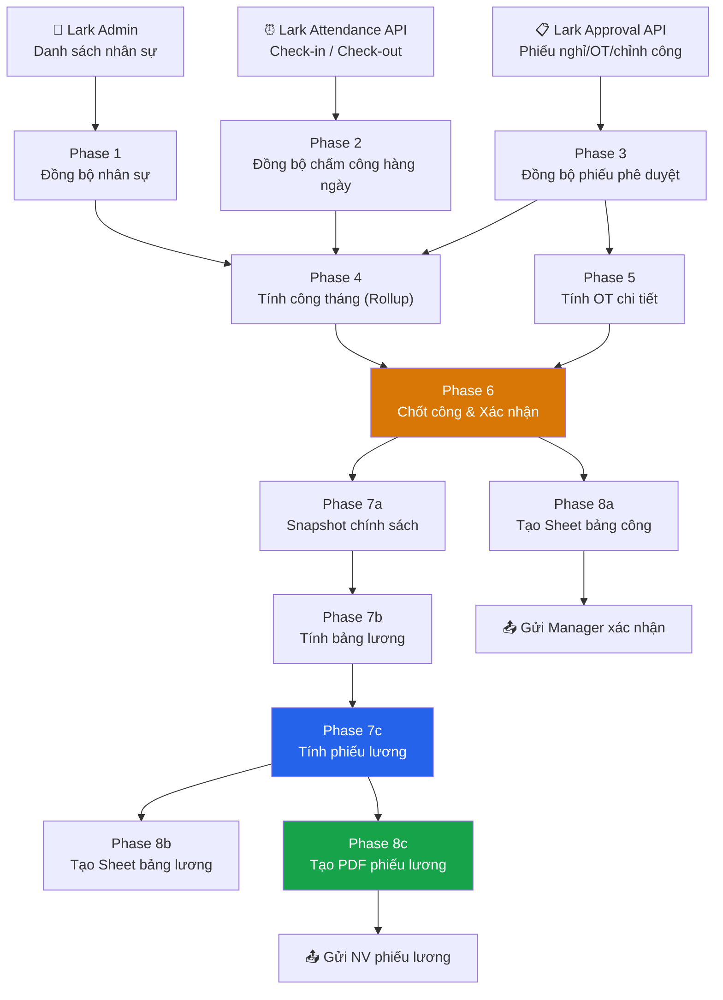
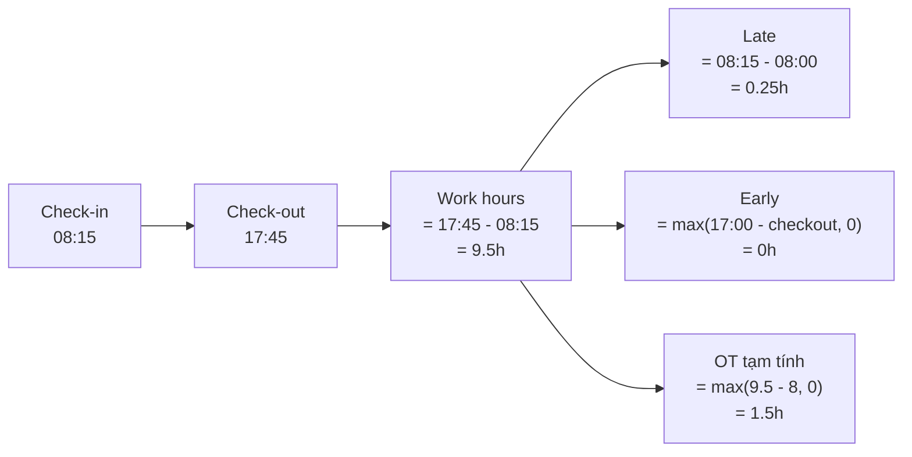
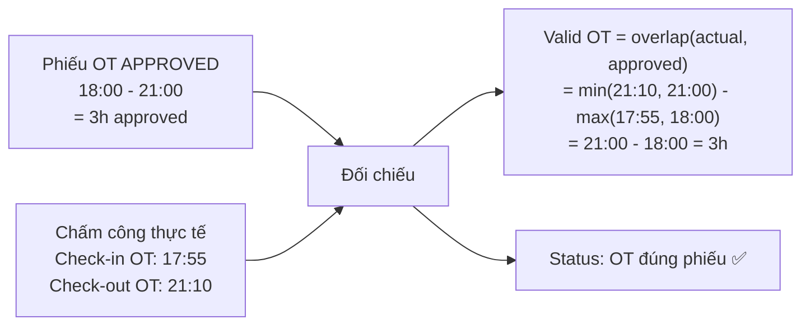
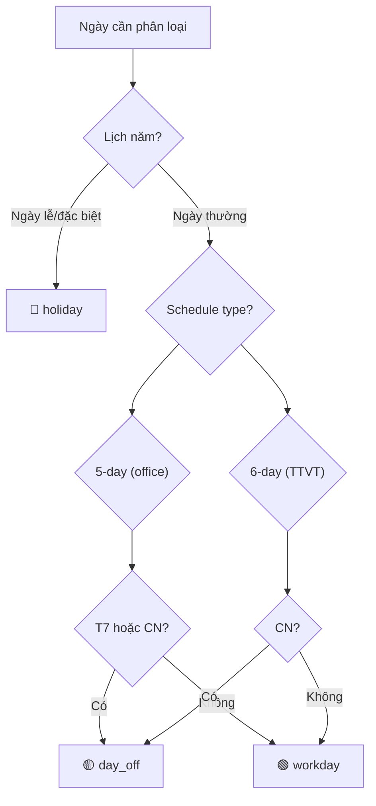
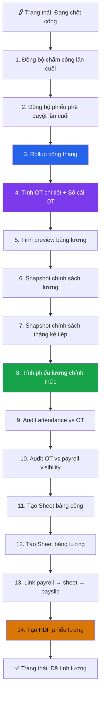
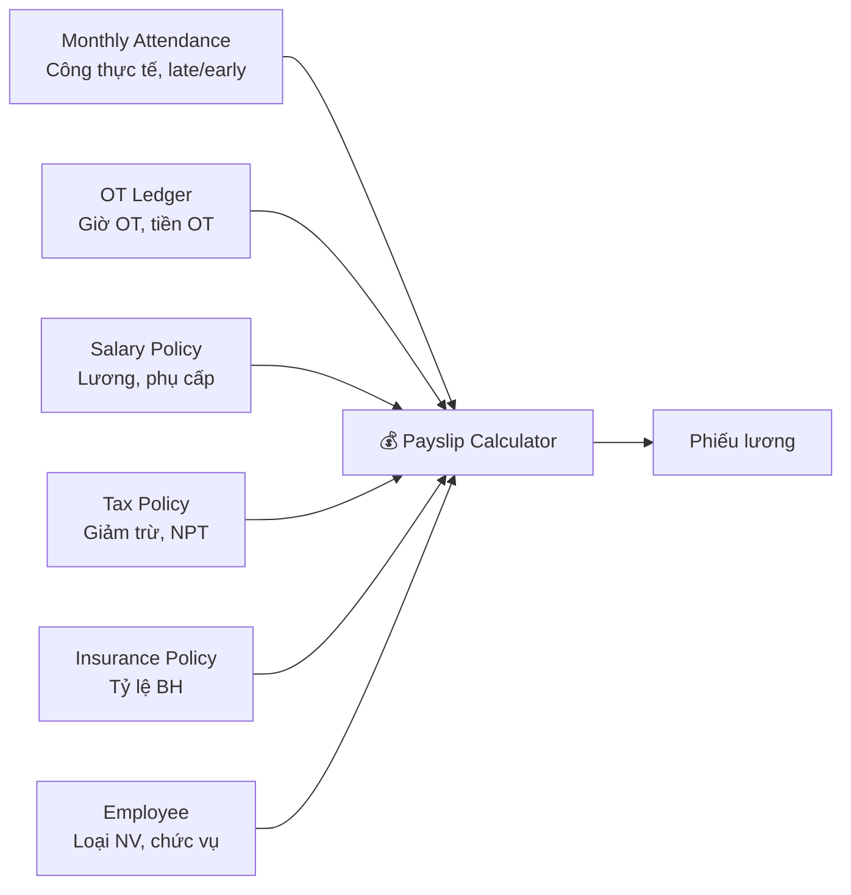

# Full Solution — Asnova Payroll System

> **Tài liệu mô tả toàn bộ quy trình** từ đồng bộ nhân sự → chấm công → phê duyệt → chốt công → tính lương → phiếu lương  
> **Dùng để**: Reference khi build platform mới (Node.js + PostgreSQL)

---

## Mục lục

1. [Tổng quan quy trình](#1-tổng-quan-quy-trình)
2. [Phase 1: Đồng bộ nhân sự từ Lark Admin](#2-đồng-bộ-nhân-sự)
3. [Phase 2: Đồng bộ chấm công hàng ngày](#3-đồng-bộ-chấm-công)
4. [Phase 3: Đồng bộ phiếu phê duyệt](#4-phiếu-phê-duyệt)
5. [Phase 4: Tính công tháng (Monthly Rollup)](#5-tính-công-tháng)
6. [Phase 5: Tính OT (Chi tiết)](#6-tính-ot)
7. [Phase 6: Chốt công & xác nhận](#7-chốt-công)
8. [Phase 7: Tính lương & phiếu lương](#8-tính-lương)
9. [Phase 8: Xuất Sheet & PDF](#9-xuất-sheet)
10. [Chính sách lương, BH, thuế](#10-chính-sách)
11. [Quản lý phép năm](#11-phép-năm)

---

## 1. Tổng quan quy trình



### Automation Schedule

| Luồng | Tần suất | Mô tả |
|-------|----------|-------|
| Đồng bộ chấm công | ⏱️ 30 phút | Lark Attendance API → `daily_attendance` |
| Đồng bộ phiếu phê duyệt | ⏱️ 30 phút | Lark Approval API → `approval_records` |
| Rollup công tháng | ⏱️ 30 phút | Tổng hợp `monthly_attendance` |
| Tính phiếu lương | ⏱️ 30 phút | Cập nhật `payslips` |
| Poll lịch chốt công | ⏱️ 30 phút | Check auto-close conditions |
| Tạo Sheet lương | 📅 Daily 06:00 | Upload Lark Sheet |
| Tính OT / BH / Sheet công | 🔘 Manual/Webhook | Khi chốt công hoặc trigger thủ công |

---

## 2. Đồng bộ Nhân sự

### Nguồn dữ liệu
- **Lark Admin API**: Danh sách nhân viên, phòng ban, chức vụ, email, số điện thoại
- **Lark Base nguồn** (`AU8sbe2zVamapYsyHVbl7OlHgDh`): Chính sách lương, thuế, BH

### Dữ liệu đồng bộ

| Field | Nguồn | Ghi chú |
|-------|-------|---------|
| `user_id` | Lark Admin | Mã NV: ASV001, ASV002... |
| `full_name` | Lark Admin | |
| `department` | Lark Admin | → Xác định `schedule_type` |
| `position` | Lark Admin | |
| `email`, `mobile` | Lark Admin | |
| `join_date` | Lark Admin | |
| `open_id`, `union_id` | Lark Admin | Dùng cho API calls |
| `schedule_type` | Derived | `"ttvt"/"kho"/"warehouse"` → `six_day`, else `office` |

### Schedule Type Detection

```typescript
function detectScheduleType(department: string, group: string): 'office' | 'six_day' {
  const text = removeVietnameseTones(`${department} ${group}`).toLowerCase();
  const sixDayMarkers = ['ttvt', 'kho', 'warehouse'];
  return sixDayMarkers.some(m => text.includes(m)) ? 'six_day' : 'office';
}
```

---

## 3. Đồng bộ Chấm công Hàng ngày

### Nguồn: Lark Attendance API

```
POST /attendance/v1/user_flows/query
→ Trả về: user_id, check_time, type (in/out), location, device
→ Batch: 50 user_ids/request
```

### Tính toán công ca



### Quy tắc chi tiết

| Metric | Công thức | Ghi chú |
|--------|-----------|---------|
| **Giờ làm** | `checkout - checkin` (giờ) | Tính theo lần chấm đầu & cuối |
| **Đi muộn** | `max(checkin - 08:00, 0)` | So với ca chuẩn 08:00 |
| **Về sớm** | `max(17:00 - checkout, 0)` | So với ca chuẩn 17:00 |
| **Thiếu công** | `max(8 - work_hours, 0)` | So với 8h chuẩn |
| **OT tạm tính** | `max(work_hours - 8, 0)` | Chưa xét phiếu OT |
| **Đủ công ca** | `work_hours >= 8` | Boolean |
| **Grace period** | Check-out + 30 phút | Cho phép check-out trễ tối đa 30' |

### Kết luận công ca

| Trạng thái | Điều kiện |
|------------|-----------|
| `Đủ công ca` | `work_hours >= 8` |
| `Không đủ công ca` | `work_hours < 8` và có cả check-in/out |
| `Thiếu check-out` | Chỉ có check-in |
| `Đang trong ca` | Check-in hôm nay, chưa hết ca |

### Idempotency

- Key: `ATT-DAY-{user_id}-{yyyyMMdd}`
- UPSERT: tạo mới hoặc cập nhật record hiện có
- Giữ nguyên dữ liệu approval/OT đã match khi re-sync

---

## 4. Đồng bộ Phiếu Phê duyệt

### Nguồn: Lark Approval API

```
GET /approval/v4/instances → Danh sách phiếu APPROVED
→ Loại: Nghỉ phép, OT, Quên/chỉnh sửa chấm công
```

### Phân loại phiếu

| Loại phiếu | Keyword matching | Tác dụng |
|-------------|-----------------|----------|
| **Nghỉ phép năm** | `"phep nam"`, `"annual"` | Trừ tồn phép, tính vào paid credit |
| **Nghỉ KHL** | `"khong huong luong"`, `"unpaid"`, `"nghi om"`, `"bhxh"`, `"sick"` | Trừ khỏi công thực tế |
| **Nghỉ phúc lợi** | `"phuc loi"`, `"welfare"`, `"sinh nhat"`, `"che do"` | Tính vào paid credit |
| **Remote/WFH** | `"remote"`, `"wfh"`, `"work from home"` | Tính vào paid credit |
| **Nghỉ bù** | `"nghi bu"`, `"compensatory"`, `"comp leave"` | Tính vào paid credit |
| **Chỉnh sửa chấm công** | `"Quên/chỉnh sửa chấm công"` | Bổ sung giờ thiếu |
| **OT** | `"OT"`, chính sách = `"Tính lương OT"` | Tính OT chi tiết |
| **Thay đổi giờ làm** | `"change working"` | Điều chỉnh ca |

### Approval → Attendance Matching



### Trạng thái đối chiếu OT

| Status | Điều kiện |
|--------|-----------|
| `OT đúng phiếu` | `|actual - approved| <= 0.05h` |
| `OT vượt phiếu` | `actual > approved + 0.05h` |
| `OT ít hơn phiếu` | `actual < approved - 0.05h` |
| `Thiếu check-in OT` | Không có chấm công vào OT |
| `Thiếu check-out OT` | Không có chấm công ra OT |
| `Chưa có chấm OT` | Không có chấm công OT nào |

---

## 5. Tính Công tháng (Monthly Rollup)

### Input

| Nguồn | Dữ liệu |
|-------|----------|
| `daily_attendance` | Raw work hours per day |
| `approval_records` | Leave credits, corrections |
| `leave_rules` | Standard days per schedule type |
| `work_calendar` | Holidays, weekends |
| `payroll_periods` | Period start/end dates |

### Công thức chính

```
┌─────────────────────────────────────────────────────────┐
│                                                          │
│  raw_actual_days = Σ(daily_work_hours) / 8              │
│                                                          │
│  paid_credit_hours = annual_leave                        │
│                    + benefit_leave                        │
│                    + remote_hours                         │
│                    + comp_leave_hours                     │
│                    + correction_hours                     │
│                                                          │
│  credited_days = raw_actual + paid_credits / 8           │
│  credited_days = min(credited_days, standard_days)  ←cap │
│                                                          │
│  unpaid_days = unpaid_leave_hours / 8                    │
│                                                          │
│  ╔══════════════════════════════════════════════════╗     │
│  ║ ACTUAL_DAYS = max(credited_days - unpaid_days, 0)║    │
│  ╚══════════════════════════════════════════════════╝     │
│                                                          │
│  absent_days = standard_days - actual_days               │
│                                                          │
└─────────────────────────────────────────────────────────┘
```

### Ví dụ: ASV0017

```
Standard days (Công chuẩn):  25 ngày (TTVT, Mon-Sat)
Raw actual days:             19.52 ngày (chấm công thực tế)
Annual leave approved:       8h (= 1 ngày)
Unpaid leave:                24h (= 3 ngày)

credited_days = min(19.52 + 8/8, 25) = min(20.52, 25) = 20.52
actual_days   = max(20.52 - 24/8, 0) = max(20.52 - 3, 0) = 17.52
absent_days   = 25 - 17.52 = 7.48
```

### Late/Early Offset (VPS feature)

Khi NV có phiếu chỉnh công approved, giờ đi muộn/về sớm được offset:

```typescript
// Net late/early after approved credits
const lateOffset = Math.min(lateHours, approvedCredit);
lateHours = Math.max(lateHours - lateOffset, 0);
approvedCredit -= lateOffset;
const earlyOffset = Math.min(earlyHours, approvedCredit);
earlyHours = Math.max(earlyHours - earlyOffset, 0);
```

---

## 6. Tính OT Chi tiết

### 6.1 Day Type Classification



### 6.2 Time Segment Splitting

OT được chia tại các mốc: **06:00, 17:00, 22:00, 00:00**

```
Ví dụ: OT 17:00 - 23:30

  17:00 ─────── 22:00 ─────── 23:30
  │← Segment 1 →│← Segment 2 →│
  │  5h (ngày)   │  1.5h (đêm)  │
  │  → OT 150%   │  → OT 210%   │
                    (kéo sang đêm)
```

### 6.3 Bucket Classification — Quy tắc đầy đủ

```
┌────────────────────────────────────────────────────────────────────┐
│ Input: segment(start, end, day_type, is_night_shift_category)     │
│                                                                    │
│ if day_type == HOLIDAY:                                            │
│     → is_night? OT 390% (3.9×) : OT 300% (3.0×)                 │
│                                                                    │
│ if day_type == DAY_OFF:                                            │
│     → is_night? OT 270% (2.7×) : OT 200% (2.0×)                 │
│                                                                    │
│ if is_night_shift_category:                                        │
│     → is_night? Ca đêm 30% (0.3×) : OT 150% (1.5×)              │
│                                                                    │
│ if day_type == WORKDAY:                                            │
│     if is_night:                                                   │
│         if crosses_to_dayoff → OT 200% (2.0×)                    │
│         if has_workday_evening → OT 210% (2.1×)  ← kéo sang đêm │
│         else → OT 200% (2.0×)                                    │
│     if 17:00-22:00 → OT 150% (1.5×)                              │
│     if daytime → OT 150% (1.5×)                                  │
│                                                                    │
│ default → OT 150% (1.5×)                                          │
└────────────────────────────────────────────────────────────────────┘
```

### 6.4 Bảng tổng hợp 9 Buckets

| # | Bucket | Rate | Day Type | Time Frame | Ví dụ |
|---|--------|------|----------|------------|-------|
| 1 | **OT 150%** | 1.5× | Ngày thường | 17:00-22:00 | Làm thêm buổi tối |
| 2 | **OT 200%** | 2.0× | Ngày nghỉ / Đêm rời | Ca ngày | Làm T7/CN ca ngày |
| 3 | **OT 210%** | 2.1× | Ngày thường | Kéo sang đêm | OT 17:00→23:00 (phần 22-23h) |
| 4 | **OT 130%** | 1.3× | Ngày thường | Ca đêm chính | Ca đêm cố định |
| 5 | **Ca đêm 30%** | 0.3× | Ngày thường | Phụ cấp đêm | 22:00-06:00 |
| 6 | **Night 50%** | 0.5× | Ngày thường | Ngoài 06-22h | Phụ cấp ngoài khung |
| 7 | **OT 270%** | 2.7× | Ngày nghỉ | Ca đêm | T7/CN ca đêm |
| 8 | **OT 300%** | 3.0× | Ngày lễ | Ca ngày | 30/4, 1/5 ca ngày |
| 9 | **OT 390%** | 3.9× | Ngày lễ | Ca đêm | 30/4, 1/5 ca đêm |

### 6.5 Tính tiền OT

```typescript
// Hourly rate
const baseSalary = isProbation ? offerSalary * 0.85 : offerSalary;
const dailyRate = (baseSalary + rankAllowance) / standardDays;
const hourlyRate = roundUp(dailyRate / 8, -1);  // Làm tròn lên hàng chục

// Per bucket
const unitRate = roundUp(hourlyRate * bucketRate, -1);
const otMoney = roundUp(unitRate * validHours, -1);

// Ví dụ: Lương 12M, 22 ngày công
// dailyRate = 12,000,000 / 22 = 545,454
// hourlyRate = roundUp(545,454 / 8) = 68,190 → 68,190
// OT 150%: unitRate = roundUp(68,190 × 1.5) = 102,290
// 3h OT: otMoney = roundUp(102,290 × 3) = 306,870
```

### 6.6 Giới hạn OT

| Rule | Giới hạn | Hành vi |
|------|----------|---------|
| **Max giờ/ngày** | 4h | Warning, không hard block |
| **Max giờ/tháng** | 40h | Warning |
| **Ca liên tục** | 12h | Alert nếu >= 12h |
| **Buckets kiểm tra daily** | OT 150%, 200%, 300% | Các bucket khác không check daily |

### 6.7 OT Ledger Aggregation

```sql
-- Monthly OT per employee
SELECT
  employee_id,
  SUM(valid_hours) AS total_hours,
  SUM(ot_amount) AS total_amount,
  jsonb_object_agg(bucket, jsonb_build_object(
    'hours', SUM(valid_hours),
    'amount', SUM(ot_amount),
    'rate', bucket_rate
  )) AS breakdown,
  -- Alerts
  ARRAY_AGG(DISTINCT date) FILTER (WHERE daily_hours > 4) AS over_daily_dates,
  bool_or(SUM(valid_hours) > 40) AS over_monthly_limit
FROM ot_details
WHERE period_id = :period_id
GROUP BY employee_id;
```

---

## 7. Chốt công & Xác nhận

### 7.1 Lịch chốt công (Payroll Period)

| Field | Ví dụ | Mô tả |
|-------|-------|-------|
| `Tháng lương` | Tháng 05/2026 | Label |
| `Ngày bắt đầu kỳ công` | 2026-04-19 | Period start |
| `Ngày kết thúc kỳ công` | 2026-05-27 | Period end |
| `Ngày giờ chốt công` | 2026-05-28 10:00 | Scheduled close time |
| `Tự động chốt` | ✅ | Enable auto-close |
| `Trạng thái` | Sẵn sàng chốt | Current status |

### 7.2 Auto-close Conditions

```typescript
function isDue(period: PayrollPeriod): boolean {
  return period.autoClose === true
    && ['Đã lên lịch', 'Sẵn sàng chốt'].includes(period.status)
    && period.closeAt <= new Date();
}
```

### 7.3 Close Process — 14 Steps



### 7.4 Gửi xác nhận Manager

Sau khi tạo Sheet bảng công:
1. **Nhóm NV theo Manager** (Quản lý trực tiếp từ HR)
2. **Tạo Lark Card** với summary: tổng NV, ngày vắng, OT hours
3. **Gửi qua Lark IM** cho Manager → Manager xem Sheet và xác nhận cho cả team
4. Trạng thái NV: `Nhân sự xác nhận = Chờ xác nhận` → `Đã xác nhận`

### 7.5 Checklist Flags

| Flag | Ghi vào khi |
|------|-------------|
| `Đã đồng bộ chấm công` | Step 1 xong |
| `Đã tổng hợp công tháng` | Step 3 xong |
| `Đã tính OT` | Step 4 xong |
| `Đã tính Phiếu lương` | Step 8 xong |
| `Đã tạo Sheet lương` | Step 12 xong |
| `Đã tạo PDF phiếu lương` | Step 14 xong |
| `Audit payroll OK` | Step 9-10 xong |
| `Hoàn tất payroll` | Tất cả xong |

---

## 8. Tính Lương & Phiếu Lương

### 8.1 Data Sources



### 8.2 Salary Computation Flow

```
┌─────────────────────────────────────────────────────────────────┐
│ 1. LƯƠNG THEO NGÀY CÔNG                                         │
│    base_salary = offer × (0.85 if probation else 1.0)           │
│    wage = base_salary + rank_allowance                           │
│    day_rate = wage / standard_days                                │
│    hour_rate = roundUp(day_rate / 8)                              │
│    work_ratio = actual_days / standard_days                       │
│    actual_salary = wage × work_ratio                              │
├─────────────────────────────────────────────────────────────────┤
│ 2. PHỤ CẤP (pro-rated theo công)                                │
│    = (ăn uống + đi lại + nhà ở + ...) × work_ratio              │
│    Điện thoại = full month (không pro-rate)                      │
├─────────────────────────────────────────────────────────────────┤
│ 3. KHẤU TRỪ                                                     │
│    Vắng mặt = 0 (đã pro-rate ở bước 1)                          │
│    Đi trễ/về sớm = −hour_rate × (late_hours + early_hours)      │
│    (G.D: không trừ đi trễ/về sớm)                               │
├─────────────────────────────────────────────────────────────────┤
│ 4. THU NHẬP TRƯỚC THUẾ                                          │
│    gross = actual_salary + allowances + OT_total                 │
│          + other_1 + other_2 + late_deduction                    │
│    (G.D: gross = actual_salary + allowances, không OT)           │
├─────────────────────────────────────────────────────────────────┤
│ 5. BẢO HIỂM                                                     │
│    → Xem mục 10                                                  │
├─────────────────────────────────────────────────────────────────┤
│ 6. THUẾ TNCN                                                     │
│    tax_exempt = OT_total + min(meal, 930K)×ratio + phone×ratio   │
│    taxable = gross − tax_exempt − insurance − self_deduction     │
│            − dependent_deduction                                  │
│    PIT = progressive_tax(taxable)                                │
│    (P-type: taxable = gross − tax_exempt, flat 10%)              │
│    (G.D: PIT = 0)                                                │
├─────────────────────────────────────────────────────────────────┤
│ 7. LƯƠNG THỰC NHẬN                                               │
│    net = round(gross − insurance − PIT                           │
│         + after_tax_adjustment − union_fee, −2)                  │
│    net = max(net, 0)                                              │
└─────────────────────────────────────────────────────────────────┘
```

### 8.3 Progressive Tax (PIT)

```typescript
function calculatePIT(taxableIncome: number): number {
  if (taxableIncome <= 0) return 0;
  const brackets = [
    { limit:  5_000_000, rate: 0.05, deduct: 0 },
    { limit: 10_000_000, rate: 0.10, deduct: 250_000 },
    { limit: 18_000_000, rate: 0.15, deduct: 750_000 },
    { limit: 32_000_000, rate: 0.20, deduct: 1_650_000 },
    { limit: 52_000_000, rate: 0.25, deduct: 3_250_000 },
    { limit: 80_000_000, rate: 0.30, deduct: 5_850_000 },
    { limit: Infinity,   rate: 0.35, deduct: 9_850_000 },
  ];
  const b = brackets.find(b => taxableIncome <= b.limit)!;
  return Math.round(taxableIncome * b.rate - b.deduct);
}
```

### 8.4 OT Check trong Phiếu lương

| Status | Điều kiện | Action |
|--------|-----------|--------|
| `Khớp sổ cái OT` | Tiền OT phiếu lương = Tiền OT sổ cái | ✅ OK |
| `Lệch OT cần kiểm tra` | Chênh lệch > 0 | ⚠️ C&B review |
| `Thiếu link sổ cái OT` | Không có link OT ledger | ⚠️ Check |
| `Không có OT tính lương` | Không có OT approved | ℹ️ Info |

---

## 9. Xuất Sheet & PDF

### 9.1 Sheet Bảng công (5 tabs)

| Tab | Nội dung | Columns |
|-----|----------|---------|
| **Phép năm 有休** | Danh sách phiếu phép năm | Ticket#, NV, ngày, giờ, tồn phép |
| **Nghỉ trừ lương 欠勤総合** | Nghỉ không lương | Ticket#, NV, lý do, giờ/ngày |
| **Nghỉ có lương 有給** | Nghỉ phúc lợi/bù | Ticket#, NV, loại, giờ |
| **OT** | Chi tiết OT 11 cột semantic | Ticket#, NV, loại ngày, buckets |
| **Change working** | Đổi ca/giờ làm | Ticket#, NV, giờ cũ/mới |

### 9.2 Sheet Bảng lương (1 sheet)

| Nhóm cột | Cột | Nội dung |
|-----------|------|----------|
| A-H | Nhân sự | Mã NV, tên, vị trí, loại NV, ngày vào, lương offer |
| I-S | Lương & phụ cấp | Lương, 10 loại phụ cấp |
| AD-AJ | Công | Công chuẩn, thực tế, phép, vắng, trễ/sớm |
| AL-AQ | Giờ OT | 6 buckets OT chính (hours) |
| AU-AZ | Tiền OT | 6 buckets OT (amount, formula) |
| BD | Tổng gross | Thu nhập trước thuế |
| BI-BM | Bảo hiểm | Mức đóng, BHXH/BHYT/BHTN |
| BO-BQ | Thuế | Giảm trừ, thu nhập chịu thuế, thuế TNCN |
| BS | **Net salary** | Lương thực nhận |

### 9.3 PDF Phiếu lương

```
┌─────────────────────────────────────────────────────────┐
│  PHIẾU LƯƠNG / PAY-SLIP    Tháng 05/2026                │
│  Mã NV: ASV001    Tên: Nguyễn Văn A    Payday: 05/06   │
├──────────────────────┬──────────────────────────────────┤
│  BẢNG CHẤM CÔNG      │  THU NHẬP                        │
│  Công chuẩn: 22      │  Lương theo công:  10,000,000    │
│  Công thực tế: 20    │  Trừ đi trễ:       −125,000     │
│  Phép năm: 1 ngày    │  OT 150%:           306,870     │
│  Vắng mặt: 1 ngày   │  OT 200%:           204,580     │
│  Đi trễ: 0.5h       │  Phụ cấp:         2,000,000     │
│  Về sớm: 0h         │  ─────────────────────────       │
│  OT: 5h             │  Tổng gross:     12,386,450      │
├──────────────────────┼──────────────────────────────────┤
│  BẢO HIỂM            │  THUẾ TNCN                       │
│  BHXH 8%: 960,000   │  Thu nhập chịu thuế: 4,226,450  │
│  BHYT 1.5%: 180,000 │  Thuế: 211,323                   │
│  BHTN 1%: 120,000   │  Đoàn phí: 0                     │
├──────────────────────┴──────────────────────────────────┤
│                                                          │
│  💰 LƯƠNG THỰC NHẬN:  10,915,100 VNĐ                    │
│                                                          │
└─────────────────────────────────────────────────────────┘
```

---

## 10. Chính sách Lương, BH, Thuế

### 10.1 Policy Snapshot

Mỗi kỳ lương, chính sách hiện tại được **freeze (snapshot)** để:
- Giữ nguyên giá trị tại thời điểm tính lương
- Cho phép thay đổi chính sách cho kỳ sau mà không ảnh hưởng kỳ hiện tại

```
Active policy (Là chính sách hiện tại = true)
    ↓ snapshot
Frozen record (period = 202605, status = "Đang áp dụng")
    ↓ next month
Old record (Là chính sách hiện tại = false, status = "Lịch sử")
```

### 10.2 Bảo hiểm

| Loại | NLĐ | DN | Trần |
|------|------|-----|------|
| BHXH | 8% | 17.5% | 46,800,000đ |
| BHYT | 1.5% | 3% | 46,800,000đ |
| BHTN | 1% | 1% | 99,200,000đ |

**Cơ sở đóng BH** = `base_salary + rank + BPQL + sales + technical + language`

**Ngoại lệ**:
- Part-time (P), Freelance (M): không đóng BH
- G.D (Giám đốc): không đóng BHTN

### 10.3 Phụ cấp (10 loại)

| # | Phụ cấp | Pro-rate? | Ghi chú |
|---|---------|-----------|---------|
| 1 | Cấp bậc | ✅ | Nằm trong cơ sở tính lương |
| 2 | BPQL | ✅ | Bộ phận quản lý |
| 3 | Kinh doanh | ✅ | |
| 4 | Kỹ thuật | ✅ | |
| 5 | Ngoại ngữ | ✅ | |
| 6 | Nhà ở | ✅ | |
| 7 | Đi lại | ✅ | |
| 8 | Ăn uống | ✅ | Miễn thuế tối đa 930K/tháng |
| 9 | Điện thoại | ❌ Full | Miễn thuế |
| 10 | Chuyên cần | ✅ | |

---

## 11. Quản lý Phép năm

### Công thức tồn phép

```
Tồn cuối kỳ = Tồn đầu kỳ + Phép cộng + Điều chỉnh + Thâm niên − Phép đã nghỉ
```

### Validation

```typescript
const expected = opening + monthly + adjustment + seniority - used;
if (Math.abs(closing - expected) > 0.02) {
  flag('Cần kiểm tra'); // Data inconsistency
}
```

### Tác động lên công

| Loại nghỉ | Ảnh hưởng tồn phép | Ảnh hưởng công thực tế |
|------------|---------------------|----------------------|
| Phép năm | Trừ tồn phép | ✅ Tính vào paid credit |
| Nghỉ KHL | Không ảnh hưởng | ❌ Trừ khỏi actual days |
| Phúc lợi | Không ảnh hưởng | ✅ Tính vào paid credit |
| Remote | Không ảnh hưởng | ✅ Tính vào paid credit |
| Nghỉ bù | Không ảnh hưởng | ✅ Tính vào paid credit |

---

## Appendix: Platform Implementation Notes

### Database Tables (PostgreSQL)

| Table | Records/month | Frequency |
|-------|--------------|-----------|
| `employees` | ~20 | Rarely changes |
| `daily_attendance` | ~500 | 30-min sync |
| `approval_records` | ~100 | 30-min sync |
| `monthly_attendance` | ~20 | Recalculated per sync |
| `ot_details` | ~200 | Per close |
| `ot_monthly` | ~20 | Per close |
| `payslips` | ~20 | Per close |
| `salary_policies` | ~20/period | Snapshot per close |
| `audit_log` | ~1000/month | Auto (trigger) |

### API Endpoints (Node.js)

| Method | Endpoint | Mô tả |
|--------|----------|-------|
| POST | `/api/sync/attendance` | Trigger attendance sync |
| POST | `/api/sync/approvals` | Trigger approval sync |
| POST | `/api/attendance/rollup` | Recalculate monthly |
| POST | `/api/ot/calculate` | Calculate OT buckets |
| POST | `/api/payroll/close` | Execute close process |
| GET | `/api/attendance/monthly` | Get monthly attendance |
| GET | `/api/payroll/:period` | Get payroll data |
| GET | `/api/employees` | List employees |
| POST | `/api/sheets/attendance` | Generate attendance sheet |
| POST | `/api/sheets/payroll` | Generate payroll sheet |
| POST | `/api/payslip/pdf/:id` | Generate single payslip PDF |
