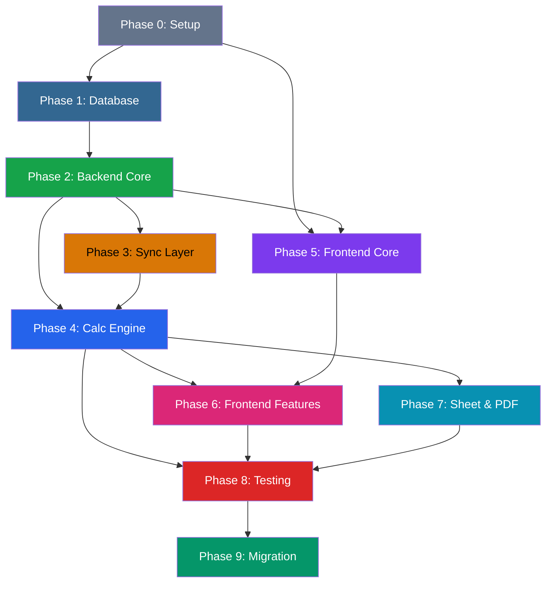

# Implementation Checklist — Asnova Payroll v2

> **Mục tiêu**: Checklist chi tiết từng hạng mục triển khai  
> **Tech Stack**: Node.js + Express + Prisma | Vite + React + Tailwind v4 | PostgreSQL 16  
> **VPS**: 61.14.233.201 (Ubuntu 22.04, Docker)
> **Reconciled**: 2026-05-31 — `npm run build` verified green for API + Web after payroll timesheet self-check UI

---

## Trạng thái thực tế sau reconciliation 2026-05-31

| Phase | Status | Evidence / Notes |
|-------|--------|------------------|
| Phase 0 | ✅ Done | Monorepo workspaces, API/Web packages, TypeScript builds |
| Phase 1 | ✅ Done | Prisma schema/migration assets present; DB source of truth model established |
| Phase 2 | ✅ Done | Express routes, env config, Prisma singleton, shared utilities |
| Phase 3 | ✅ Mostly Done | Lark clients, inbound sync, scheduler, webhooks, outbound scaffold present; exports still Phase 7 |
| Phase 4 | ✅ Mostly Done | Attendance rollup, OT ledger, insurance/PIT/payslip calculators, close orchestrator compile clean |
| Phase 5 | ✅ Done | App shell, UI primitives, API client, routing, tokens |
| Phase 6 | ✅ Build Clean / In Product Review | Attendance, Approvals, Employees, Leave, Settings, Payroll compile; Payroll salary tab and timesheet self-check tab use real API data |
| Phase 7 | ⬜ Pending | Sheet/PDF generation and final Lark output artifacts |
| Phase 8 | ⬜ Pending | Automated test suite still needed |
| Phase 9 | ⬜ Pending | Production deploy/cutover not done |

### Build-Recovery Checklist
- [x] Replace remaining `monthKey(period.periodStart)` payroll lookups with `period.monthKey`
- [x] Fix API TypeScript blockers and make `npm run build:api` pass
- [x] Fix Web TypeScript blockers and make `npm run build:web` pass
- [x] Replace Payroll page mock payroll metrics/table with API-backed data
- [x] Add `/api/payroll/timesheet` self-check aggregation from organization users, monthly attendance, leave balances, and OT buckets
- [x] Rebuild Payroll **Tính công** tab with employee avatars, timeline, standard/actual days, late/early, leave used/remaining, absent days, and OT hover bucket segments
- [x] Replace remaining native selects found in Settings modals with custom `Dropdown`
- [x] Run root `npm run build` successfully
- [x] Runtime check `http://localhost:3101/payroll` for the current dev copy after syncing the same Payroll/API files into `output/asnova-payroll`

> Note: Detailed checklist items below remain as historical implementation planning granularity. Prefer the reconciliation table above for current phase status.

## Ước lượng tổng quan

| Phase | Hạng mục | Est. |
|-------|----------|------|
| 0 | Hạ tầng & Setup | 2-3 ngày |
| 1 | Database | 2-3 ngày |
| 2 | Backend Core | 5-7 ngày |
| 3 | Sync Layer | 5-7 ngày |
| 4 | Calculation Engine | 5-7 ngày |
| 5 | Frontend Core | 5-7 ngày |
| 6 | Frontend Features | 5-7 ngày |
| 7 | Sheet & PDF Generation | 3-5 ngày |
| 8 | Testing & QA | 3-5 ngày |
| 9 | Migration & Cutover | 2-3 ngày |
| **Total** | | **~37-54 ngày** |

---

## Phase 0: Hạ tầng & Project Setup

### 0.1 Monorepo Setup
- [ ] Tạo folder `packages/api` và `packages/web`
- [ ] Init root `package.json` (workspaces)
- [ ] Setup `.gitignore`, `.editorconfig`, `.prettierrc`
- [ ] Setup ESLint config (shared between api & web)
- [ ] Setup TypeScript config (`tsconfig.base.json` + per-package)
- [ ] Tạo `.env.example` với tất cả environment variables

### 0.2 Backend Project Init (`packages/api`)
- [ ] Init Node.js project (`package.json`)
- [ ] Install core deps: `express`, `prisma`, `@prisma/client`, `zod`, `cors`, `helmet`, `morgan`
- [ ] Install dev deps: `typescript`, `tsx`, `nodemon`, `@types/express`
- [ ] Setup `tsconfig.json` (target ES2022, module NodeNext)
- [ ] Setup entry point `src/server.ts`
- [ ] Setup `nodemon.json` cho dev
- [ ] Setup `npm run dev` script

### 0.3 Frontend Project Init (`packages/web`)
- [ ] Init Vite + React + TypeScript (`npx create-vite`)
- [ ] Install Tailwind CSS v4: `tailwindcss`, `@tailwindcss/vite`
- [ ] Install UI deps: `framer-motion`, `lucide-react`, `recharts`
- [ ] Install routing: `react-router`
- [ ] Install data: `@tanstack/react-query`, `axios`
- [ ] Install forms: `react-hook-form`, `zod`, `@hookform/resolvers`
- [ ] Setup `index.css` với Unified Design System `@theme` tokens
- [ ] Setup Google Fonts: Inter + JetBrains Mono
- [ ] Setup `svg.lucide { stroke-width: 1.5 !important; }`
- [ ] Setup `npm run dev` script
- [ ] Verify Tailwind v4 + `@theme` hoạt động

### 0.4 Docker Setup
- [ ] Tạo `Dockerfile` cho API (Node 20 Alpine)
- [ ] Tạo `Dockerfile` cho Web (Nginx + static build)
- [ ] Tạo `docker-compose.yml` (api + web + postgres)
- [ ] Setup volume cho PostgreSQL data
- [ ] Setup network cho inter-container communication
- [ ] Test `docker-compose up` local

### 0.5 VPS Setup
- [ ] Verify PostgreSQL 16 đang chạy trên VPS
- [ ] Tạo database `asnova_payroll` trên PostgreSQL
- [ ] Tạo user + password cho app
- [ ] Setup Nginx reverse proxy config
  - [ ] `/api/*` → port 3100
  - [ ] `/*` → port 3101
- [ ] Setup SSL (Let's Encrypt) cho domain payroll subdomain
- [ ] Test connectivity từ local → VPS PostgreSQL

---

## Phase 1: Database (Prisma Schema + Migration)

### 1.1 Core Tables
- [ ] `employees` — Danh sách nhân sự
  - [ ] Fields: user_id, full_name, department, position, schedule_type, employment_type, join_date, leave_date, status, open_id, union_id, email, mobile, lark_record_id, lark_metadata
  - [ ] Unique: user_id, lark_record_id
  - [ ] Index: department, status
- [ ] `payroll_periods` — Kỳ lương
  - [ ] Fields: month_key, label, period_start, period_end, status, auto_close, close_at, lark_record_id
  - [ ] Unique: month_key
  - [ ] Enum: status (open, scheduled, ready, closing, closed, error)

### 1.2 Attendance Tables
- [ ] `daily_attendance` — Chấm công hàng ngày
  - [ ] Fields: employee_id, attendance_date, check_in, check_out, work_hours, late_hours, early_hours, ot_hours_preliminary, missing_hours, conclusion, source, idempotency_key, lark_record_id, raw_data, synced_at
  - [ ] Unique: idempotency_key
  - [ ] Index: (employee_id, attendance_date)
- [ ] `monthly_attendance` — Công tháng
  - [ ] Fields: employee_id, period_id, standard_days, raw_actual_days, paid_credit_hours, unpaid_hours, actual_days, absent_days, work_hours, late_hours, early_hours, annual_leave_hours, benefit_leave_hours, remote_hours, comp_leave_hours, correction_hours, lark_record_id, calculated_at
  - [ ] Unique: (employee_id, period_id)

### 1.3 Approval Tables
- [ ] `approval_records` — Phiếu phê duyệt
  - [ ] Fields: employee_id, instance_code, approval_type, leave_type, leave_type_bucket, status, apply_date, approved_hours, approved_days, start_time, end_time, lark_record_id, raw_data, synced_at
  - [ ] Unique: instance_code
  - [ ] Index: (employee_id, apply_date), leave_type_bucket

### 1.4 OT Tables
- [ ] `ot_details` — Chi tiết OT
  - [ ] Fields: employee_id, approval_id, period_id, work_date, bucket, rate, hours, valid_hours, amount, day_type, start_time, end_time, idempotency_key, lark_record_id, calculated_at
  - [ ] Unique: idempotency_key
  - [ ] Index: (employee_id, period_id), bucket
- [ ] `ot_monthly` — Sổ cái OT tháng
  - [ ] Fields: employee_id, period_id, total_hours, total_amount, bucket_breakdown (JSON), over_daily_dates (JSON), over_monthly_limit, lark_record_id, calculated_at
  - [ ] Unique: (employee_id, period_id)

### 1.5 Policy Tables
- [ ] `salary_policies` — Chính sách lương
  - [ ] Fields: employee_id, period_key, is_current, base_salary, offer_salary, ratio, rank_allowance, bpql_allowance, sales_allowance, technical_allowance, language_allowance, housing_allowance, transport_allowance, meal_allowance, phone_allowance, attendance_allowance, daily_rate, hourly_rate, lark_record_id
  - [ ] Unique: (employee_id, period_key)
- [ ] `insurance_policies` — BHXH, BHYT, BHTN
  - [ ] Fields: employee_id, period_key, is_current, insurance_basis, bhxh_rate_employee, bhyt_rate_employee, bhtn_rate_employee, bhxh_rate_employer, bhyt_rate_employer, bhtn_rate_employer, bhxh_employee, bhyt_employee, bhtn_employee, total_employee, bhxh_employer, bhyt_employer, bhtn_employer, total_employer, grand_total, lark_record_id
  - [ ] Unique: (employee_id, period_key)
- [ ] `tax_policies` — Thuế TNCN
  - [ ] Fields: employee_id, period_key, is_current, personal_deduction, dependents, dependent_deduction, tax_code, lark_record_id
  - [ ] Unique: (employee_id, period_key)

### 1.6 Payroll Tables
- [ ] `payslips` — Phiếu lương
  - [ ] Fields: employee_id, period_id, standard_days, actual_days, work_ratio, base_salary, actual_salary, allowances_total, ot_total_hours, ot_total_amount, ot_bucket_breakdown (JSON), late_deduction, gross_income, insurance_employee, insurance_employer, tax_exempt, taxable_income, pit_amount, after_tax_adjustment, union_fee, net_salary, status, full_breakdown (JSON), lark_record_id, calculated_at
  - [ ] Unique: (employee_id, period_id)
  - [ ] Enum: status (draft, confirmed, paid)

### 1.7 Leave & Calendar Tables
- [ ] `leave_balances` — Tồn phép năm
  - [ ] Fields: employee_id, month_key, opening, accrued, used, adjustment, seniority_bonus, closing, lark_record_id
  - [ ] Unique: (employee_id, month_key)
- [ ] `leave_rules` — Quy tắc nghỉ
  - [ ] Fields: month_key, schedule_type, days_in_month, saturdays, sundays, holidays, standard_days, working_days, lark_record_id
  - [ ] Unique: (month_key, schedule_type)
- [ ] `work_calendar` — Lịch năm
  - [ ] Fields: calendar_date, day_type, counts_as_standard, note, lark_record_id
  - [ ] Unique: calendar_date
  - [ ] Enum: day_type (workday, saturday, sunday, holiday, company_trip)

### 1.8 System Tables
- [ ] `sync_jobs` — Lịch sử sync
  - [ ] Fields: job_type, direction (inbound/outbound), status, started_at, finished_at, records_processed, records_created, records_updated, records_failed, error_message, metadata (JSON)
- [ ] `audit_log` — Nhật ký thay đổi
  - [ ] Fields: table_name, record_id, action (INSERT/UPDATE/DELETE), old_data (JSON), new_data (JSON), changed_by, changed_at
  - [ ] SQL trigger cho mọi core tables
- [ ] `close_process_log` — Log chốt công
  - [ ] Fields: period_id, step_name, step_order, status, started_at, finished_at, error_message, output (JSON)

### 1.9 Migration & Seed
- [ ] Run `prisma migrate dev` tạo tables
- [ ] Tạo seed script: admin user, default leave rules, work calendar 2026
- [ ] Tạo SQL triggers cho audit_log
- [ ] Tạo SQL views: `v_monthly_attendance_calculated`, `v_payslip_summary`
- [ ] Verify schema trên VPS PostgreSQL

---

## Phase 2: Backend Core (Express + Middleware)

### 2.1 Server Foundation
- [ ] Express app setup (`src/server.ts`)
- [ ] CORS config (allow frontend origin)
- [ ] Helmet (security headers)
- [ ] Morgan (request logging)
- [ ] JSON body parser (limit 10MB)
- [ ] Error handling middleware (global)
- [ ] Request validation middleware (Zod)
- [ ] Prisma client singleton (`src/shared/db/prisma.ts`)

### 2.2 Config & Environment
- [ ] `src/config/env.ts` — validate env vars with Zod
  - [ ] DATABASE_URL
  - [ ] LARK_APP_ID, LARK_APP_SECRET
  - [ ] LARK_APP_TOKEN (Base token)
  - [ ] PORT, NODE_ENV
  - [ ] JWT_SECRET (if auth needed)
- [ ] `src/config/constants.ts` — Business constants
  - [ ] STANDARD_HOURS = 8
  - [ ] STANDARD_CHECKIN = "08:00"
  - [ ] STANDARD_CHECKOUT = "17:00"
  - [ ] CHECKOUT_GRACE_MINUTES = 30
  - [ ] MONTHLY_OT_LIMIT = 40
  - [ ] DAILY_OT_LIMIT = 4
  - [ ] INSURANCE_CAPS
  - [ ] PIT_BRACKETS
  - [ ] OT_BUCKETS (9 buckets)

### 2.3 Shared Utilities
- [ ] `src/shared/utils/round.ts` — round(), roundUp()
- [ ] `src/shared/utils/vietnamese.ts` — removeVietnameseTones()
- [ ] `src/shared/utils/date.ts` — monthKey(), monthLabel(), isNight(), nextBoundary()
- [ ] `src/shared/utils/money.ts` — formatVND(), formatMoney()
- [ ] `src/shared/utils/idempotency.ts` — generateKey()

### 2.4 API Route Structure
- [ ] `src/routes/index.ts` — Route registrar
- [ ] Health check: `GET /api/health`
- [ ] Module routes:
  - [ ] `/api/employees`
  - [ ] `/api/attendance`
  - [ ] `/api/approvals`
  - [ ] `/api/ot`
  - [ ] `/api/payroll`
  - [ ] `/api/leave`
  - [ ] `/api/sync`
  - [ ] `/api/settings`
  - [ ] `/api/dashboard`

---

## Phase 3: Sync Layer (Lark ↔ PostgreSQL)

### 3.1 Lark API Client
- [ ] `src/shared/lark/auth.ts` — Tenant access token (auto-refresh)
- [ ] `src/shared/lark/base.ts` — Lark Base CRUD helpers
  - [ ] `listRecords(tableId, filter, pageSize)`
  - [ ] `getRecord(tableId, recordId)`
  - [ ] `createRecords(tableId, records[])`
  - [ ] `updateRecords(tableId, records[])`
  - [ ] `deleteRecords(tableId, recordIds[])`
  - [ ] `batchUpdate(tableId, records[])` — chunked 500/batch
- [ ] `src/shared/lark/attendance.ts` — Attendance API
  - [ ] `queryUserFlows(userIds[], dateRange)`
  - [ ] `queryUserTasks(userIds[], dateRange)`
- [ ] `src/shared/lark/approval.ts` — Approval API
  - [ ] `listInstances(approvalCode, dateRange)`
  - [ ] `getInstance(instanceCode)`
- [ ] `src/shared/lark/sheets.ts` — Sheets API
  - [ ] `createSheet(title)`
  - [ ] `writeValues(sheetId, range, values)`
  - [ ] `applyStyles(sheetId, styles)`
  - [ ] `importXlsx(fileToken)`
- [ ] `src/shared/lark/im.ts` — IM API (send cards)
  - [ ] `sendCard(userId, card)`
- [ ] `src/shared/lark/drive.ts` — Drive API
  - [ ] `uploadMedia(file, fileName)`
- [ ] `src/shared/lark/table-config.ts` — Table IDs mapping
  - [ ] All 15+ table IDs as constants
  - [ ] Field name → field_id mapping per table
  - [ ] Read-only field registry (formula/lookup/auto)

### 3.2 Inbound Sync: Lark → PostgreSQL
- [ ] `src/modules/sync/inbound/sync-employees.ts`
  - [ ] Fetch from Lark Admin API
  - [ ] Upsert `employees` table
  - [ ] Detect schedule_type from department
- [ ] `src/modules/sync/inbound/sync-attendance.ts`
  - [ ] Fetch attendance flows from Lark API
  - [ ] Calculate work_hours, late, early, preliminary OT
  - [ ] Upsert `daily_attendance` with idempotency key
  - [ ] Preserve existing approval/OT data on re-sync
- [ ] `src/modules/sync/inbound/sync-approvals.ts`
  - [ ] Fetch approved instances from Lark API
  - [ ] Classify leave_type_bucket (annual, unpaid, benefit, remote, comp, correction, ot, change)
  - [ ] Upsert `approval_records` by instance_code
- [ ] `src/modules/sync/inbound/sync-leave-rules.ts`
  - [ ] Fetch from Lark Base source
  - [ ] Upsert `leave_rules` and `work_calendar`
- [ ] `src/modules/sync/inbound/sync-policies.ts`
  - [ ] Fetch salary/tax/insurance from Lark Base
  - [ ] Upsert policy tables

### 3.3 Outbound Sync: PostgreSQL → Lark Base
- [x] `src/modules/sync/sync-outbound.ts` — unified outbound sync
  - [x] Read `monthly_attendance`, `ot_monthly`, `ot_details`, `leave_balances`, `payslips` from DB
  - [x] Build Lark payload from PostgreSQL source-of-truth snapshots
  - [x] Fetch Base field schema and skip formula/lookup/auto/reverse-link fields
  - [x] Upsert by stable business keys (`User_id + Tháng lương`, `Mã dòng OT`, `Mã sổ cái OT`, `SourceID`)
  - [x] Store created `lark_record_id` back to PostgreSQL for later updates
  - [x] Track manual outbound runs in `sync_jobs`
  - [x] Wire close-process step `outbound_sync_lark`
  - [x] Verify `POST /api/sync/outbound/:periodId` with 05/2026: attendance `16`, OT ledger `7`, OT details `62`, leave `16`, payslips `17`, all errors `0`

### 3.4 Scheduler (Cron Jobs)
- [ ] `src/scheduler/index.ts` — node-cron setup
- [ ] Attendance sync: every 30 min
- [ ] Approval sync: every 30 min
- [ ] Monthly rollup: every 30 min
- [ ] Close calendar poll: every 30 min
- [ ] Health check: every 5 min

---

## Phase 4: Calculation Engine

### 4.1 Attendance Module
- [ ] `src/modules/attendance/leave-classifier.ts`
  - [ ] `classifyLeaveType(leaveType, label)` → bucket
  - [ ] Keyword matching (Vietnamese + English)
  - [ ] Unit tests cho mỗi loại leave
- [ ] `src/modules/attendance/rollup.ts`
  - [ ] `calculateMonthlyAttendance(employeeId, periodId)`
  - [ ] Aggregate daily_attendance → raw_actual_days
  - [ ] Sum leave credits by bucket
  - [ ] Calculate actual_days = min(raw + credits, standard) − unpaid
  - [ ] Calculate absent_days
  - [ ] Offset late/early with correction credits
  - [ ] Upsert `monthly_attendance`
- [ ] `src/modules/attendance/rollup-all.ts`
  - [ ] Batch rollup tất cả employees cho 1 period

### 4.2 OT Module
- [ ] `src/modules/ot/day-type.ts`
  - [ ] `resolveDayType(date, scheduleType, calendar)` → workday/day_off/holiday
  - [ ] 5-day vs 6-day schedule handling
  - [ ] Holiday override from work_calendar
- [ ] `src/modules/ot/time-segments.ts`
  - [ ] `splitIntoSegments(start, end)` → segments[]
  - [ ] Boundaries at 06:00, 17:00, 22:00, 00:00
  - [ ] Handle overnight OT (cross-midnight)
- [ ] `src/modules/ot/bucket-classifier.ts`
  - [ ] `classifySegment(segment, dayType, isNightShift)` → bucket
  - [ ] Full 9-bucket logic
  - [ ] Unit tests cho mỗi scenario
- [ ] `src/modules/ot/ot-calculator.ts`
  - [ ] `calculateOtDetails(approval, attendance, calendar)` → OtDetail[]
  - [ ] Match approval with attendance
  - [ ] Split into segments → classify → calculate amount
  - [ ] Daily limit check (4h)
- [ ] `src/modules/ot/ot-ledger.ts`
  - [ ] `aggregateOtMonthly(employeeId, periodId)` → OtMonthly
  - [ ] Sum per bucket
  - [ ] Monthly limit check (40h)
  - [ ] Continuous shift alert (12h)
- [ ] `src/modules/ot/hourly-rate.ts`
  - [ ] `calculateHourlyRate(salary, standardDays, isProbation)`
  - [ ] `calculateUnitRate(hourlyRate, bucketRate)`
  - [ ] roundUp logic

### 4.3 Insurance Module
- [ ] `src/modules/payroll/insurance.ts`
  - [ ] `calculateInsurance(baseSalary, employmentType, position)`
  - [ ] BHXH/BHYT/BHTN rates (employee + employer)
  - [ ] Cap logic: 46.8M (BHXH/BHYT), 99.2M (BHTN)
  - [ ] Exceptions: P-type, M-type, G.D

### 4.4 Tax Module
- [ ] `src/modules/payroll/pit.ts`
  - [ ] `calculatePIT(taxableIncome)` → progressive tax
  - [ ] 7 brackets
  - [ ] P-type: flat 10% (no deductions)
  - [ ] G.D: PIT = 0

### 4.5 Payslip Module
- [ ] `src/modules/payroll/gross-income.ts`
  - [ ] `calculateGrossIncome(salary, attendance, ot, allowances)`
  - [ ] Pro-rate allowances by work_ratio
  - [ ] Late/early deduction (except G.D)
  - [ ] OT integration
- [ ] `src/modules/payroll/net-salary.ts`
  - [ ] `calculateNetSalary(gross, insurance, pit, adjustments)`
  - [ ] Round to nearest 100, clamp to 0
- [ ] `src/modules/payroll/payslip-calculator.ts`
  - [ ] `calculatePayslip(employeeId, periodId)` → full payslip
  - [ ] Orchestrate: attendance → OT → insurance → gross → PIT → net
  - [ ] Store full_breakdown JSON
  - [ ] OT check status (khớp sổ cái / lệch)

### 4.6 Policy Snapshot Module
- [ ] `src/modules/payroll/policy-snapshot.ts`
  - [ ] `createPolicySnapshots(periodId)` — salary, tax, insurance
  - [ ] Freeze current policies for the period
  - [ ] Deactivate old "current" records
  - [ ] Cross-link to payslips

### 4.7 Leave Balance Module
- [ ] `src/modules/leave/balance.ts`
  - [ ] `updateLeaveBalance(employeeId, monthKey)`
  - [ ] Opening + accrued + adjustment + seniority − used = closing
  - [ ] Validation: |closing − expected| <= 0.02

### 4.8 Close Process Orchestrator
- [ ] `src/modules/payroll/close-process.ts`
  - [ ] `executeCloseProcess(periodId)` — 14 steps
  - [ ] Step-by-step execution with logging
  - [ ] Rollback on error
  - [ ] Status updates per step
  - [ ] Checklist flags

---

## Phase 5: Frontend Core

### 5.1 Design System Components (`src/components/ui/`)
- [ ] `KpiCard.tsx` — Stat card with icon + value + trend
- [ ] `DataTable.tsx` — Sortable, selectable, paginated table
  - [ ] Column definitions with type (text, number, date, status)
  - [ ] `font-mono tabular-nums` for all numeric columns
  - [ ] Sort toggle (ArrowUpDown)
  - [ ] Row selection (checkbox)
  - [ ] Pagination
  - [ ] Staggered row animation
- [ ] `Dropdown.tsx` — Custom dropdown (3 variants)
  - [ ] Standard
  - [ ] Multi-select with chip tags
  - [ ] Searchable (combobox)
- [ ] `Modal.tsx` — Dialog with overlay + spring animation
- [ ] `Toast.tsx` — Notification system (success/info/warning/error)
- [ ] `StatusBadge.tsx` — Dot + label badge
- [ ] `FormInput.tsx` — Input with label + validation
- [ ] `FormSelect.tsx` — Custom select (NOT native)
- [ ] `Button.tsx` — Primary/secondary/destructive variants
- [ ] `Avatar.tsx` — Image or initials fallback
- [ ] `Breadcrumbs.tsx` — Navigation breadcrumbs
- [ ] `Pagination.tsx` — Page navigation
- [ ] `Sidebar.tsx` — App sidebar navigation
- [ ] `PageHeader.tsx` — Page title + actions
- [ ] `LoadingSkeleton.tsx` — Loading placeholders
- [ ] `EmptyState.tsx` — No data illustration

### 5.2 Layout & Routing
- [ ] `src/App.tsx` — Router setup
- [ ] `src/layouts/AppLayout.tsx` — Sidebar + header + content
- [ ] Routes:
  - [ ] `/` → redirect to `/dashboard`
  - [ ] `/dashboard`
  - [ ] `/attendance`
  - [ ] `/attendance/:employeeId`
  - [ ] `/employees`
  - [ ] `/employees/:id`
  - [ ] `/payroll`
  - [ ] `/payroll/:periodId`
  - [ ] `/ot`
  - [ ] `/leave`
  - [ ] `/settings`
  - [ ] `/settings/periods`
  - [ ] `/settings/sync`
  - [ ] `/audit`

### 5.3 API Client & State
- [ ] `src/services/api.ts` — Axios instance + interceptors
- [ ] `src/services/queries/` — React Query hooks
  - [ ] `useEmployees()`, `useEmployee(id)`
  - [ ] `useMonthlyAttendance(periodId)`
  - [ ] `usePayslips(periodId)`
  - [ ] `useOtLedger(periodId)`
  - [ ] `useDashboard(periodId)`
  - [ ] `useSyncStatus()`
  - [ ] `useLeaveBalances(monthKey)`
- [ ] `src/services/mutations/` — Mutation hooks
  - [ ] `useTriggerSync(type)`
  - [ ] `useRecalculate()`
  - [ ] `useClosePayroll(periodId)`
  - [ ] `useUpdateEmployee()`
- [ ] `src/stores/app-store.ts` — Zustand global state
  - [ ] selectedPeriod
  - [ ] selectedDepartment
  - [ ] sidebarCollapsed
  - [ ] toast queue

### 5.4 Types
- [ ] `src/types/employee.ts`
- [ ] `src/types/attendance.ts`
- [ ] `src/types/approval.ts`
- [ ] `src/types/ot.ts`
- [ ] `src/types/payroll.ts`
- [ ] `src/types/leave.ts`
- [ ] `src/types/api.ts` — API response wrappers

---

## Phase 6: Frontend Features (Pages)

### 6.1 Dashboard (`/dashboard`)
- [ ] KPI Cards row: Tổng NV, Công chuẩn, NV nghỉ KHL, Trạng thái kỳ
- [ ] Bảng công tóm tắt (DataTable top 10)
- [ ] Chart: Attendance trends (Bar chart)
- [ ] Chart: OT distribution (Donut chart)
- [ ] Sync status panel (last sync time per type)
- [ ] Quick actions: Sync Now, Recalculate, Generate Sheet
- [ ] Period selector (dropdown)

### 6.2 Attendance Page (`/attendance`)
- [ ] Period selector
- [ ] Department filter
- [ ] DataTable: Mã NV, Tên, Công chuẩn, Công thực tế, Vắng, Late, Early, Leave hours
  - [ ] All numeric columns: `font-mono tabular-nums`
  - [ ] Color coding: absent > 0 = warning, unpaid > 0 = destructive
- [ ] Click row → Employee attendance detail
- [ ] Bulk actions: Recalculate selected
- [ ] Export CSV

### 6.3 Employee Attendance Detail (`/attendance/:employeeId`)
- [ ] Employee header (avatar, name, department, schedule type)
- [ ] Monthly summary cards (standard, actual, absent, leave, OT)
- [ ] Daily attendance table (date, check-in, check-out, hours, late, early, conclusion)
- [ ] Approval records list (type, dates, hours, status)
- [ ] Leave balance card
- [ ] Timeline visualization (calendar heatmap)

### 6.4 Employees Page (`/employees`)
- [ ] DataTable: Code, Name, Department, Position, Type, Status
- [ ] Search by name/code
- [ ] Filter by department, status
- [ ] Click → Employee detail
- [ ] Status badge (active/inactive)

### 6.5 Employee Detail (`/employees/:id`)
- [ ] Profile section (avatar, contact info)
- [ ] Current policies tabs:
  - [ ] Salary policy
  - [ ] Insurance policy
  - [ ] Tax policy
- [ ] Edit form (modal)
- [ ] Attendance history
- [ ] Leave balance history

### 6.6 Payroll Page (`/payroll`)
- [x] Period selector
- [x] API-backed payroll metrics and payslip table (`/api/periods`, `/api/payroll`, `/api/payroll/summary`)
- [x] DataTable: Tên, Gross, BH, Thuế, Net, Status
  - [x] All money columns: `font-mono tabular-nums`, VND format
  - [x] Status badge: draft/confirmed/paid
- [ ] Click row → Payslip detail modal
- [x] Calculate payroll action
- [x] Close payroll action
- [ ] Progress indicator (14 steps)
- [ ] Export Excel

### 6.7 Payslip Detail Modal
- [ ] 2-column layout matching PDF format
- [ ] Left: Attendance summary
- [ ] Right: Income breakdown
  - [ ] Salary, allowances, OT per bucket, deductions, gross
  - [ ] Insurance details
  - [ ] Tax calculation
  - [ ] Net salary (highlighted)
- [ ] OT check status
- [ ] Download PDF button

### 6.8 OT Page (`/ot`)
- [ ] Period selector
- [ ] DataTable: Employee, Total hours, Total amount, Bucket breakdown
- [ ] Expand row → OT details (date, bucket, hours, amount)
- [ ] OT alerts (daily > 4h, monthly > 40h)
- [ ] Chart: OT by bucket (stacked bar)
- [ ] Chart: OT by employee (horizontal bar)

### 6.9 Leave Page (`/leave`)
- [ ] Period selector
- [ ] DataTable: Employee, Opening, Accrued, Used, Closing
- [ ] Validation flags (mismatched balances)
- [ ] Leave approval list

### 6.10 Settings Page (`/settings`)
- [ ] Periods management (CRUD)
  - [ ] Create new period
  - [ ] Set auto-close schedule
  - [ ] Status management
- [ ] Sync controls
  - [ ] Manual trigger buttons (Attendance, Approvals, Rollup, OT)
  - [ ] Sync history table
  - [ ] Last sync timestamp per type
- [ ] Leave rules editor
- [ ] Work calendar editor

### 6.11 Audit Page (`/audit`)
- [ ] Filterable audit log (table, action, date range, user)
- [ ] Close process log per period
- [ ] Diff viewer (old_data vs new_data)

---

## Phase 7: Sheet & PDF Generation

### 7.1 Attendance Sheet
- [ ] Excel template engine (exceljs hoặc xlsx)
- [ ] 5 tabs: Phép năm, Nghỉ KHL, Nghỉ có lương, OT (11 semantic columns), Change working
- [ ] Approval → tab classification
- [ ] OT semantic column mapping
- [ ] Summary rows per tab
- [ ] Hyperlinks to Lark Base records
- [ ] Upload to Lark as Sheet
- [ ] Link to close calendar record

### 7.2 Payroll Sheet
- [ ] Excel template with ~70 columns (A-BS)
- [ ] Formula cells for OT amounts, insurance, tax
- [ ] Color-coded headers per section
- [ ] Upload to Lark / import as Sheet
- [ ] Link to payslips & close calendar

### 7.3 Payslip PDF
- [ ] HTML → PDF engine (Puppeteer hoặc wkhtmltopdf)
- [ ] Template: 2-column, US Letter, single page
- [ ] Vietnamese number formatting (1.234.567 VNĐ)
- [ ] Upload PDF to Lark Drive
- [ ] Attach to payslip record

### 7.4 Notifications
- [ ] Manager attendance card (Lark Card JSON 2.0)
  - [ ] Group employees by manager
  - [ ] Summary: NV count, absent, OT hours
  - [ ] Link to attendance sheet
- [ ] Payslip notification to employee (optional)

---

## Phase 8: Testing & QA

### 8.1 Unit Tests
- [ ] Leave type classifier — all 8 types
- [ ] OT bucket classifier — all 9 buckets
- [ ] OT time segment splitting — midnight crossing
- [ ] Day type resolver — 5-day, 6-day, holiday override
- [ ] Actual days formula — credits, unpaid, cap
- [ ] Insurance calculator — caps, exceptions (P, M, G.D)
- [ ] PIT calculator — 7 brackets, P-type flat
- [ ] Net salary — rounding, clamp to 0
- [ ] Hourly rate — roundUp logic
- [ ] Late/early offset with corrections

### 8.2 Integration Tests
- [ ] Sync attendance flow (mock Lark API → DB)
- [ ] Sync approval flow (mock → DB)
- [ ] Rollup pipeline (daily → monthly)
- [ ] OT calculation pipeline (approval → details → ledger)
- [ ] Payslip pipeline (attendance + OT + policy → payslip)
- [ ] Close process (14 steps end-to-end)

### 8.3 Data Validation
- [ ] Parallel run: Python cũ vs Node.js mới cho cùng 1 tháng
- [ ] Compare: monthly_attendance values
- [ ] Compare: OT details & ledger values
- [ ] Compare: payslip values (gross, insurance, PIT, net)
- [ ] Compare: leave balances
- [ ] Tolerance: ±1 VNĐ for rounding differences

### 8.4 Frontend Testing
- [ ] Component tests (React Testing Library)
- [ ] DataTable rendering + sorting
- [ ] Number formatting (tabular-nums, VND)
- [ ] Responsive layout (mobile → desktop)
- [ ] E2E: Dashboard loads with data
- [ ] E2E: Attendance table filters work
- [ ] E2E: Payslip modal displays correctly

---

## Phase 9: Migration & Cutover

### 9.1 Data Migration
- [ ] Export current Lark Base data → PostgreSQL
  - [ ] employees
  - [ ] salary/tax/insurance policies
  - [ ] leave rules & work calendar
  - [ ] historical monthly_attendance (last 3 months)
  - [ ] historical payslips (last 3 months)
  - [ ] leave balances
- [ ] Verify record counts match
- [ ] Verify lark_record_id mapping

### 9.2 Parallel Run (1 payroll cycle)
- [ ] Run both systems for 1 full month
- [ ] Compare outputs at each stage
- [ ] Fix any discrepancies
- [ ] Get C&B sign-off on results

### 9.3 Cutover
- [ ] Switch automation_runner to disabled on VPS
- [ ] Enable Node.js scheduler
- [ ] Update Nginx to serve new frontend
- [ ] Monitor for 1 week
- [ ] Decommission Python containers (keep backup)

### 9.4 Documentation
- [ ] User guide cho C&B team
- [ ] Admin guide (sync controls, settings)
- [ ] Runbook: troubleshooting common issues
- [ ] API documentation (Swagger/OpenAPI)

---

## Dependency Graph



### Critical Path
```
Phase 0 → Phase 1 → Phase 2 → Phase 3 + Phase 4 → Phase 7 → Phase 8 → Phase 9
                                    ↓
                              Phase 5 → Phase 6 ↗
```

**Phase 3 + 4** và **Phase 5 + 6** có thể chạy song song.
